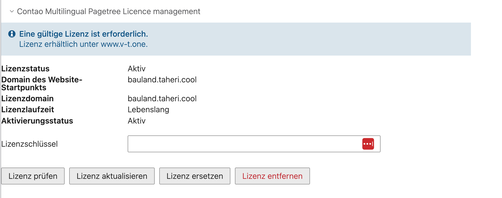
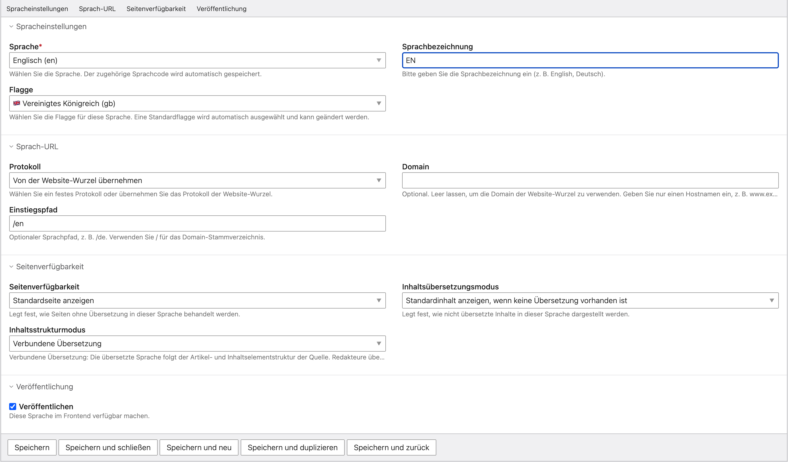
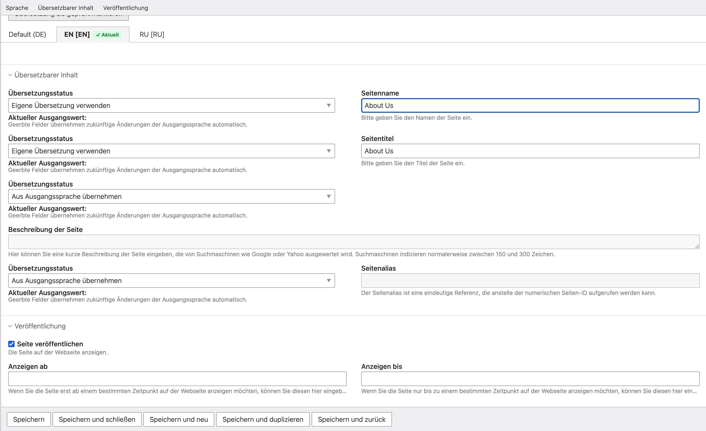

# Einführung

Contao Multilingual Pagetree ergänzt Contao um einen redaktionellen Übersetzungs-Workflow, ohne für jede Sprache einen eigenen Seitenbaum anzulegen. Alle Sprachen eines Website-Startpunkts teilen sich **eine** Seitenstruktur. Übersetzt wird über Sprachreiter direkt in den gewohnten Contao-Formularen.

Wo eine Sprache redaktionell eigenständig arbeiten soll, kann sie ihre Inhalte stattdessen unabhängig pflegen. Beides lässt sich je Sprache getrennt einstellen und jederzeit ändern, ohne Daten zu verlieren.

## Über dieses Handbuch

Dieses Handbuch beschreibt die tatsächlich implementierte Funktionalität des Pakets. Es richtet sich an Administratoren, die das Paket installieren und konfigurieren, sowie an Redakteure, die damit übersetzen.

Die deutsche Fassung ist die Standardfassung der Dokumentation. Eine gleichwertige englische Fassung liegt unter `docs/en/INSTALLATION-AND-USER-MANUAL.md`.

| Angabe | Wert |
| --- | --- |
| Produkt | Contao Multilingual Pagetree |
| Composer-Paket | `vtinnovations/contao-multilingual-pagetree` |
| PHP-Namensraum | `Vtinnovations\ContaoMultilingualPagetree` |
| Pakettyp | `contao-bundle` |
| Lizenz | proprietär |
| Herausgeber | V&T Innovations |
| Website | https://www.v-t.one |

## Schreibweisen in diesem Handbuch

Beschriftungen der Benutzeroberfläche erscheinen **fett** und entsprechen exakt den deutschen Beschriftungen im Contao-Backend. Konsolenbefehle stehen in Codeblöcken und gelten für eine Contao Managed Edition; bei abweichender Installation ist der Pfad zur Konsole anzupassen.

> **Hinweis:** Alle Beispiel-Domains in diesem Handbuch (`example.com`, `ru.example.com`) sind Platzhalter. Setzen Sie dort Ihre eigenen Hostnamen ein.

# Funktionsübersicht

Die folgenden Funktionen sind im Paket implementiert.

## Sprachen und Struktur

| Funktion | Beschreibung |
| --- | --- |
| Mehrere Zusatzsprachen je Startpunkt | Beliebig viele Zielsprachen je Website-Startpunkt |
| Gemeinsamer Seitenbaum | Alle Sprachen teilen sich eine Seitenstruktur |
| Sprachreiter | Sprachauswahl direkt im Seiten- und Inhaltsformular |
| Sprachauswahl aus bekannten Sprachen | Auswahlliste statt freier Eingabe |
| Automatische Sprachcode-Speicherung | Der Sprachcode wird aus der Auswahl abgeleitet |
| Sprachbezeichnung | Eigene Beschriftung je Sprache |
| Auswählbare Flaggen | Flagge je Sprache wählbar |
| Automatische Standardflagge | Passende Flagge wird vorbelegt |
| Startpunkt-Isolation | Jeder Startpunkt bildet eine eigene Website-Grenze |

## Sprach-URLs

| Funktion | Beschreibung |
| --- | --- |
| Übernommenes oder festes Protokoll | HTTPS, HTTP oder Übernahme vom Startpunkt |
| Gemeinsame oder eigene Domain | Sprache auf der Startpunkt-Domain oder auf eigener Domain |
| Konfigurierbarer Einstiegspfad | Optionaler Sprachpfad je Sprache |
| Eigene Sprachdomain | Sprache wird ab der Wurzel ihrer Domain ausgeliefert |
| Pfadpräfix-Unterstützung | Mehrere Sprachen unter einer Domain |
| Kanonische URLs | `rel="canonical"` je Sprache |
| `hreflang` | Alternativangaben für alle verfügbaren Sprachen |
| `x-default` | Standardziel für nicht zugeordnete Sprachen |

## Übersetzen

| Funktion | Beschreibung |
| --- | --- |
| Seitenverfügbarkeitsregeln | Verhalten nicht übersetzter Seiten je Sprache |
| Inhalts-Fallback-Regeln | Verhalten nicht übersetzter Inhalte je Sprache |
| Verbundene Übersetzung | Struktur folgt der Ausgangssprache |
| Freier Sprachinhalt | Eigenständige Artikel- und Inhaltsstruktur |
| Feldweise Vererbung oder eigene Übersetzung | Für Seiten, Artikel, News, Termine und FAQ |
| Native Inhaltselement-Maske | Inhaltselemente nutzen das native Contao-Formular |
| Übersetzte RTE-Inhalte | Rich-Text-Felder sind übersetzbar |
| Redaktioneller Prüfstatus | Prüfstatus und Prüfvermerk für Übersetzungen |
| Veröffentlichung je Sprache | Sprachen einzeln freischalten |

## Frontend

| Funktion | Beschreibung |
| --- | --- |
| Sprachwechsler als Frontend-Modul | Modul **Contao Multilingual Pagetree Sprachwechsler** |
| Sechs Darstellungen | Flaggen, Beschriftungen und Kombination, horizontal und vertikal |
| Bearbeitbares Sprachwechsler-Template | Überschreibbar über die Contao-Templateverwaltung |
| Behandlung der aktiven Sprache | Aktive Sprache markieren oder ausblenden |
| Behandlung nicht verfügbarer Sprachen | Ausblenden oder deaktiviert anzeigen |

## Betrieb

| Funktion | Beschreibung |
| --- | --- |
| Lizenzverwaltung | Lizenzpanel je Website-Startpunkt |
| Berechtigungen über Contao-Standardrechte | Keine paketeigene Berechtigung erforderlich |
| Deutsche und englische Backend-Übersetzung | Vollständige Beschriftungen in beiden Sprachen |
| Integritätsprüfung und -reparatur | Konsolenbefehle mit Vorschau |
| Datenbericht | Übersicht der gespeicherten Paketdaten |

# Systemvoraussetzungen

| Voraussetzung | Version |
| --- | --- |
| PHP | `^8.1` |
| Contao | `^5.0` (`contao/core-bundle`) |
| Composer | Für Installation und Aktualisierung |
| Datenbank | Die von Ihrer Contao-Installation verwendete Datenbank |
| PHPUnit | `^10.5`, nur für die Entwicklung |

Contao 4 wird nicht unterstützt.

## Optionale Erweiterungen

Die Integrationen für Nachrichten, Termine und FAQ werden erst aktiv, wenn das jeweilige Contao-Bundle installiert ist:

- `contao/news-bundle`
- `contao/calendar-bundle`
- `contao/faq-bundle`

Das Paket wird bewusst nach diesen Bundles geladen. Fehlt eines davon, bleibt die zugehörige Integration einfach inaktiv; ein Fehler entsteht nicht.

## Schreibrechte

Der PHP-Prozess benötigt Schreibrechte unterhalb von `var/`:

| Verzeichnis | Zweck |
| --- | --- |
| `var/contao-multilingual-pagetree/state/` | Interner Betriebszustand |
| `var/contao-multilingual-pagetree/licences/` | Gespeicherter Lizenzstatus je Website-Startpunkt |

Das Paket schreibt ausschließlich unterhalb von `var/` und damit außerhalb des öffentlichen Verzeichnisses. Existieren die Verzeichnisse noch nicht, ist das ein gültiger Ausgangszustand.

# Installation

Contao Multilingual Pagetree ist ein proprietäres Paket, das auf Packagist veröffentlicht ist. Die Installation in eine gewöhnliche Contao-Installation erfolgt daher auf dem üblichen Weg — über den Contao Manager oder mit Composer. Ein zusätzlicher Repository-Eintrag oder ein manuell bereitgestelltes Archiv sind nicht erforderlich.

> **Hinweis:** Die Paketseite lautet [packagist.org/packages/vtinnovations/contao-multilingual-pagetree](https://packagist.org/packages/vtinnovations/contao-multilingual-pagetree). Proprietär bezieht sich auf die Lizenzbedingungen, nicht auf den Vertriebsweg: Der Code wird wie jedes andere Composer-Paket bezogen, und für die Verwaltung mehrsprachiger Inhalte ist weiterhin eine V-T.ONE-Lizenz erforderlich.

## Vor der Installation

1. Sichern Sie die Datenbank **und** das Verzeichnis `files/`.
2. Prüfen Sie die Systemvoraussetzungen.
3. Halten Sie fest, welche Sprachen jeder Website-Startpunkt ausliefern soll.
4. Halten Sie fest, welche Sprache je Startpunkt die Ausgangssprache ist. Maßgeblich ist die native Contao-Sprache des Startpunkts.
5. Installieren und prüfen Sie zuerst auf einer Testumgebung mit einer Kopie der Produktivdaten.

## Erstinstallation über den Contao Manager

1. Öffnen Sie den Contao Manager und melden Sie sich an.
2. Wechseln Sie in den Bereich **Pakete**.
3. Suchen Sie nach `vtinnovations/contao-multilingual-pagetree` und fügen Sie das Paket hinzu.
4. Führen Sie die Paketänderungen aus. Der Contao Manager installiert das Paket und aktualisiert den Autoloader.
5. Wechseln Sie anschließend in den Bereich **Wartung** und führen Sie die Datenbankmigration aus.
6. Leeren Sie den Anwendungscache.

Das Paket bringt ein Contao-Manager-Plugin mit. Die Registrierung des Bundles geschieht dadurch automatisch; ein manueller Eintrag in einer Bundle-Konfiguration ist nicht erforderlich.

## Erstinstallation über Composer

```bash
composer require vtinnovations/contao-multilingual-pagetree
```

Anschließend Contao einrichten und die Datenbank aktualisieren:

```bash
vendor/bin/contao-console cache:clear
vendor/bin/contao-console contao:migrate
```

In einer Contao Managed Edition fasst der folgende Befehl das Einrichten der Anwendung einschließlich der Veröffentlichung der Bundle-Assets zusammen:

```bash
vendor/bin/contao-console contao:setup
```

## Aktualisierung einer bestehenden Installation

```bash
composer update vtinnovations/contao-multilingual-pagetree
vendor/bin/contao-console contao:migrate
vendor/bin/contao-console cache:clear
```

Im Contao Manager entspricht das dem Aktualisieren des Pakets, gefolgt von Datenbankmigration und Cache-Neuaufbau.

## Ersetzen einer älteren ZIP-Installation

> **Warnung:** Ersetzen Sie das Paketverzeichnis **vollständig**. Wird ein Archiv nur über eine bestehende Installation entpackt, bleiben Dateien einer früheren Version zurück, die inzwischen entfernt wurden. Das führt zu schwer nachvollziehbaren Fehlern.

1. Sichern Sie Datenbank und Dateien.
2. Entfernen Sie das bisherige Paketverzeichnis vollständig.
3. Spielen Sie das neue Paketarchiv ein.
4. Aktualisieren Sie den Autoloader (Composer beziehungsweise Contao Manager).
5. Führen Sie die Datenbankmigration aus.
6. Bauen Sie den Cache neu auf.

## Datenbankaktualisierung

Das Paket legt eigene Tabellen und Spalten an und bringt Migrationen mit. Die Datenbankaktualisierung ist deshalb **zwingend** erforderlich:

```bash
vendor/bin/contao-console contao:migrate
```

Führen Sie den Befehl anschließend ein zweites Mal aus. Der zweite Durchlauf muss ohne weitere Änderungen enden.

Die mitgelieferten Migrationen sind wiederholbar ausgelegt und löschen keine mehrdeutigen Daten. Mehrdeutigkeiten werden stattdessen von der Integritätsprüfung gemeldet.

## Cache leeren und neu aufbauen

```bash
vendor/bin/contao-console cache:clear
vendor/bin/contao-console cache:clear --env=prod
vendor/bin/contao-console cache:warmup --env=prod
```

Im Contao Manager entspricht das der Aktion, die den Anwendungscache leert.

## Installation überprüfen

**Bundle-Registrierung prüfen.** Lassen Sie die verfügbaren Konsolenbefehle auflisten:

```bash
vendor/bin/contao-console list contao-multilingual-pagetree
```

Erscheinen die Befehle des Pakets, ist das Bundle registriert und der Dienstcontainer wurde erfolgreich übersetzt.

**Frontend-Assets prüfen.** Die Stylesheets, Skripte und Flaggengrafiken des Pakets werden unter dem folgenden Pfad im öffentlichen Verzeichnis veröffentlicht:

```
bundles/vtinnovationscontaomultilingualpagetree/
```

Fehlt das Verzeichnis, wiederholen Sie `contao:setup` beziehungsweise die Asset-Installation Ihrer Installation.

**Templates prüfen.** Das Sprachwechsler-Template wird von Contao bereitgestellt, sobald das Bundle registriert ist. Es erscheint bei der Auswahl **Template** des Frontend-Moduls und in der Templateverwaltung.

**Backend prüfen.** Öffnen Sie **Seiten**. An einem Website-Startpunkt muss die Globus-Aktion für die Sprachverwaltung erscheinen; im Bearbeitungsformular des Startpunkts muss der Bereich **Contao Multilingual Pagetree Licence management** erscheinen.

# Lizenzaktivierung und Lizenzverwaltung

Für die Verwaltung mehrsprachiger Inhalte ist eine gültige Lizenz erforderlich.

Die Lizenz ist kostenlos und wird lebenslang ausgestellt. Es gibt weder eine kostenpflichtige noch eine befristete Stufe: Eine Lizenz schaltet dauerhaft den vollen Funktionsumfang frei. Kostenlos bedeutet allerdings nicht lizenzfrei — die Lizenz muss am Website-Startpunkt aktiviert werden, bevor die mehrsprachige Verwaltung zur Verfügung steht.

> **Hinweis:** Eine gültige V-T.ONE-Lizenz ist erforderlich. Lizenzen erhalten Sie kostenlos unter [www.v-t.one](https://www.v-t.one).

## Lizenzverwaltung öffnen

1. Öffnen Sie **Seiten**.
2. Bearbeiten Sie den Website-Startpunkt.
3. Öffnen Sie den Bereich **Contao Multilingual Pagetree Licence management**.

Die Lizenz wird **je Website-Startpunkt** verwaltet. Eine Installation mit mehreren Startpunkten benötigt je Startpunkt eine eigene Aktivierung.



Abbildung 1 zeigt den Bereich im Zustand einer aktiven Lizenz. Der Hinweiskasten am oberen Rand nennt die Lizenzpflicht und die Bezugsquelle und wird unabhängig vom Status angezeigt.

## Angezeigte Statusfelder

| Feld | Bedeutung |
| --- | --- |
| **Lizenzstatus** | Ergebnis der letzten Statusermittlung, zum Beispiel **Aktiv**, **Nicht aktiviert**, **Falsche Domain** oder **Abgelaufen** |
| **Domain des Website-Startpunkts** | Die im Startpunkt konfigurierte Domain, gegen die die Lizenz gilt |
| **Lizenzdomain** | Die Domain, für die die Lizenz ausgestellt wurde |
| **Lizenzlaufzeit** | Immer **Lebenslang**; eine andere Laufzeit gibt es für dieses Produkt nicht |
| **Aktivierungsstatus** | **Aktiv**, wenn für diesen Startpunkt eine nutzbare Lizenz hinterlegt ist, sonst **Nicht aktiv** |

In Abbildung 1 stimmen **Domain des Website-Startpunkts** und **Lizenzdomain** überein, die **Lizenzlaufzeit** lautet **Lebenslang** und sowohl **Lizenzstatus** als auch **Aktivierungsstatus** lauten **Aktiv**. Das ist der Normalzustand einer korrekt aktivierten, unbefristeten Lizenz: Die mehrsprachige Verwaltung ist vollständig freigeschaltet, und es sind keine weiteren Schritte nötig.

## Das Feld Lizenzschlüssel

Das Feld **Lizenzschlüssel** nimmt den Ihnen zugeteilten Schlüssel entgegen. Die Eingabe ist verdeckt, und der Schlüssel wird nach dem Speichern nicht wieder angezeigt. Für eine Statusabfrage oder eine Aktualisierung muss das Feld leer bleiben.

## Die Schaltflächen

| Schaltfläche | Wirkung |
| --- | --- |
| **Lizenz prüfen** | Prüft die hinterlegte Lizenz und meldet, ob sie unversehrt und für diesen Startpunkt gültig ist. Es wird nichts geändert. |
| **Lizenz aktualisieren** | Holt den aktuellen Lizenzstatus und aktualisiert die hinterlegten Angaben. |
| **Lizenz ersetzen** | Ersetzt den hinterlegten Schlüssel durch einen neu eingegebenen. |
| **Lizenz entfernen** | Entfernt die hinterlegte Lizenz nach Rückfrage. Mehrsprachige Daten bleiben unverändert. |

Ist für den Startpunkt noch keine Lizenz hinterlegt, erscheint statt **Lizenz ersetzen** die Schaltfläche **Lizenz aktivieren**.

## Eine Lizenz aktivieren

1. Öffnen Sie die Lizenzverwaltung des Startpunkts.
2. Stellen Sie sicher, dass unter **Domain des Website-Startpunkts** die richtige Domain steht. Ist sie leer, konfigurieren Sie zuerst die Domain des Startpunkts und speichern Sie.
3. Geben Sie den Lizenzschlüssel in das Feld **Lizenzschlüssel** ein.
4. Klicken Sie **Lizenz aktivieren**.
5. Prüfen Sie danach die Statusfelder: **Aktivierungsstatus** muss **Aktiv** lauten.

## Domain-Übereinstimmung

Eine Lizenz gilt für **genau eine** Domain. Verglichen wird exakt: Eine `www`-Variante, eine übergeordnete Domain und eine benachbarte Subdomain sind jeweils andere Domains.

Weicht die Domain des Startpunkts von der Lizenzdomain ab, meldet das Lizenzpanel **Falsche Domain**, und die lizenzpflichtigen Funktionen bleiben gesperrt. Umziehende Installationen und Testumgebungen benötigen deshalb eine für die dort verwendete Domain ausgestellte Lizenz.

## Verhalten ohne gültige Lizenz

Ein Lizenzproblem legt niemals eine laufende Website still.

| Bereich | Verhalten ohne gültige Lizenz |
| --- | --- |
| Frontend-Auslieferung bestehender Übersetzungen | Läuft unverändert weiter |
| Sprachwechsler, kanonische URLs, `hreflang` | Laufen unverändert weiter |
| Zusätzliche Sprachen anlegen und bearbeiten | Gesperrt |
| Übersetzungen bearbeiten | Gesperrt |
| Prüfstatus setzen | Gesperrt |
| Freier Sprachinhalt | Gesperrt |
| Integritätsreparatur | Gesperrt; die reine Prüfung bleibt verfügbar |

Schlägt eine Prüfung fehl, bleiben die eingeschränkten Funktionen deaktiviert, statt in einen ungesicherten Zustand zu wechseln. Im Backend erscheint dann der Hinweis, dass eine gültige Lizenz erforderlich ist.

## Lizenzstatus auf der Konsole

```bash
vendor/bin/contao-console contao-multilingual-pagetree:registration
```

Der Befehl gibt den Registrierungsstatus aus, ohne einen Schlüssel anzuzeigen.

# Website-Startpunkt anlegen

Das Paket setzt einen regulären Contao-Website-Startpunkt voraus.

1. Öffnen Sie **Seiten**.
2. Legen Sie eine neue Seite an und wählen Sie als Seitentyp **Startpunkt einer Webseite**.
3. Tragen Sie unter **Sprache** die Ausgangssprache der Website ein. Diese native Contao-Angabe ist die Ausgangs- beziehungsweise Standardsprache; das Paket führt dafür keine eigene Sprache.
4. Tragen Sie unter **Domainname** den Hostnamen des Startpunkts ein. Die Domain wird für die Lizenzzuordnung und für die Auflösung der Sprach-URLs benötigt.
5. Aktivieren Sie **Seite veröffentlichen**, sobald die Seite erreichbar sein soll.
6. Speichern Sie.

> **Wichtig:** Ohne konfigurierte Domain kann für den Startpunkt keine Lizenz aktiviert werden. Das Lizenzpanel meldet in diesem Fall **Fehlende Domain**.

Jeder Startpunkt bildet eine eigene Website-Grenze. Sprachen, Übersetzungen und Lizenzen eines Startpunkts sind von denen anderer Startpunkte getrennt.

# Zusätzliche Sprachen konfigurieren

## Die Sprachverwaltung öffnen

1. Öffnen Sie **Seiten**.
2. Klicken Sie am Website-Startpunkt auf die **Globus-Aktion**. Sie öffnet die Sprachverwaltung dieses Startpunkts.
3. Wählen Sie **Sprache hinzufügen**, um eine Zielsprache anzulegen, oder **Sprache bearbeiten**, um eine bestehende zu ändern.

Die Liste zeigt je Sprache Flagge, **Sprachbezeichnung** und Sprachcode. Über **Sichtbarkeit umschalten** lässt sich eine Sprache veröffentlichen oder zurückziehen, über **Sprache löschen** entfernen.



Abbildung 2 zeigt das vollständige Formular einer Zielsprache. Es ist in vier Bereiche gegliedert, die den Reitern am oberen Rand entsprechen: **Spracheinstellungen**, **Sprach-URL**, **Seitenverfügbarkeit** und **Veröffentlichung**.

## Spracheinstellungen

### Sprache

Das Pflichtfeld **Sprache** enthält eine Auswahlliste bekannter Sprachen, in Abbildung 2 mit dem Wert **Englisch (en)**.

> **Hinweis:** Der zugehörige Sprachcode wird automatisch gespeichert. Sie müssen ihn nicht separat eingeben.

Die Ausgangssprache des Startpunkts kann nicht zusätzlich als Zielsprache angelegt werden, und dieselbe Zielsprache kann je Startpunkt nur einmal existieren. Beide Fälle weist das Formular beim Speichern ab.

### Sprachbezeichnung

**Sprachbezeichnung** ist die Beschriftung, die Redakteure im Backend und Besucher im Sprachwechsler sehen. In Abbildung 2 lautet sie `EN`. Üblich sind Werte wie `English`, `Deutsch` oder `Русский`.

Bleibt das Feld leer, wird beim Speichern eine Bezeichnung aus der gewählten Sprache abgeleitet.

### Flagge

**Flagge** bestimmt die Flaggengrafik der Sprache. Zu jeder Sprache wird automatisch eine Standardflagge vorbelegt — in Abbildung 2 **Vereinigtes Königreich (gb)** für Englisch. Sie können sie jederzeit ändern, etwa um für Englisch die Flagge der Vereinigten Staaten zu verwenden.

## Sprach-URL

Der Bereich **Sprach-URL** bestimmt, unter welcher Adresse die Sprache ausgeliefert wird. Alle drei Felder sind optional. Dieses Thema wird im folgenden Kapitel ausführlich behandelt.

## Seitenverfügbarkeit

Der Bereich **Seitenverfügbarkeit** enthält drei Auswahlfelder: **Seitenverfügbarkeit**, **Inhaltsübersetzungsmodus** und **Inhaltsstrukturmodus**. Sie werden in den Kapiteln *Seitenverfügbarkeit*, *Inhaltsübersetzungsmodus* und *Inhaltsstrukturmodus* beschrieben.

> **Hinweis:** Diese drei Einstellungen sind nur für Zielsprachen sinnvoll. Für die Ausgangssprache des Startpunkts sind sie ohne Wirkung, weil diese immer den Quell-Seitenbaum verwendet.

## Veröffentlichung

Das Kontrollkästchen **Veröffentlichen** schaltet die Sprache im Frontend frei. Siehe das Kapitel *Sprachen veröffentlichen*.

## Speichern

Am Fuß des Formulars stehen die gewohnten Contao-Schaltflächen **Speichern**, **Speichern und schließen**, **Speichern und neu**, **Speichern und duplizieren** und **Speichern und zurück**. Alle Prüfungen der Sprach-URL laufen beim Speichern serverseitig.

# Sprach-URL konfigurieren

Der Bereich **Sprach-URL** enthält drei Felder.

## Protokoll

**Protokoll** legt fest, mit welchem Schema die Sprache adressiert wird.

| Option | Wirkung |
| --- | --- |
| **Von der Website-Wurzel übernehmen** | Das Protokoll des Website-Startpunkts wird verwendet (Vorgabe) |
| **HTTPS** | Die Sprache verwendet immer HTTPS |
| **HTTP** | Die Sprache verwendet immer HTTP |

In Abbildung 2 steht das Feld auf **Von der Website-Wurzel übernehmen**.

> **Hinweis:** Zwei Sprachen dürfen sich nicht ausschließlich im Protokoll unterscheiden, wenn sie denselben Hostnamen und denselben Einstiegspfad verwenden. Eine solche Konfiguration wird beim Speichern abgewiesen.

## Domain

**Domain** ist optional. Bleibt das Feld leer, wird die Domain des Website-Startpunkts verwendet. Tragen Sie ausschließlich einen Hostnamen ein, zum Beispiel `www.example.de`.

Abgewiesen werden: Angaben mit Protokoll (`https://…`), mit Pfad, mit Portangabe, mit Query-String und mit Fragment. Ebenso abgewiesen wird ein Hostname, der bereits einem anderen Website-Startpunkt gehört, weil eingehende Anfragen dann nicht mehr eindeutig zugeordnet werden könnten.

> **Wichtig:** Eine eigene Sprachdomain muss im DNS und in der Webserver-Konfiguration auf dieselbe Contao-Installation zeigen, und es muss ein gültiges Zertifikat dafür vorliegen. Das Paket kann das nicht ersetzen.

## Einstiegspfad

**Einstiegspfad** ist der optionale Sprachpfad, zum Beispiel `/de`. Der Wert `/` bezeichnet das Domain-Stammverzeichnis.

Abgewiesen werden vollständige URLs, Hostnamen, Query-Strings, Fragmente, die Segmente `.` und `..` sowie mehrfache Schrägstriche.

## Die drei Grundkonfigurationen

### 1. Startpunkt-Domain mit Sprachpfad

| Feld | Wert |
| --- | --- |
| **Domain** | *(leer)* |
| **Einstiegspfad** | `/en` |

Ergebnis: `https://example.com/en`

Das ist die Konfiguration aus Abbildung 2 und der übliche Fall, wenn alle Sprachen unter einer Domain liegen sollen.

### 2. Eigene Sprachdomain ab ihrer Wurzel

| Feld | Wert |
| --- | --- |
| **Domain** | `ru.example.com` |
| **Einstiegspfad** | *(leer)* oder `/` |

Ergebnis: `https://ru.example.com`

Die Sprache wird ab der Wurzel ihrer eigenen Domain ausgeliefert. Der Sprachcode wird **nicht** angehängt.

### 3. Eigene Sprachdomain mit Pfad

| Feld | Wert |
| --- | --- |
| **Domain** | `ru.example.com` |
| **Einstiegspfad** | `/ru` |

Ergebnis: `https://ru.example.com/ru`

## Leerer Einstiegspfad und `/`

Ein leerer **Einstiegspfad** und ein ausdrückliches `/` sind nicht in jedem Fall dasselbe. Maßgeblich ist, ob die Sprache eine eigene **Domain** besitzt:

| **Domain** | **Einstiegspfad** | Wirksamer Einstiegspfad |
| --- | --- | --- |
| gesetzt | *(leer)* | Domain-Wurzel — wie `/` |
| gesetzt | `/` | Domain-Wurzel |
| gesetzt | `/ru` | `/ru` |
| *(leer)* | `/en` | `/en` |
| *(leer)* | *(leer)* | Der Sprachcode der Sprache, zum Beispiel `/ru` |

Nur in der letzten Zeile unterscheiden sich die beiden Zustände: Ohne eigene Domain und ohne Einstiegspfad behält der Datensatz die Adressierung, die er hatte, bevor diese Felder eingeführt wurden — die Sprache liegt dann unter ihrem Sprachcode. Sobald eine eigene Domain gesetzt ist, bedeutet ein leerer Einstiegspfad die Wurzel dieser Domain.

## Eindeutigkeit der Zuordnung

Beim Speichern wird geprüft, dass die Sprachen eines Startpunkts eindeutig adressierbar bleiben. Abgewiesen werden unter anderem:

- zwei veröffentlichte Sprachen mit gleichem Hostnamen und gleichem Einstiegspfad,
- zwei Sprachen, die dieselbe Domain-Wurzel beanspruchen,
- Zuordnungen, die erst nach Normalisierung identisch werden, etwa `de` und `/de` oder `WWW.EXAMPLE.DE.` und `www.example.de`,
- eine Unterscheidung allein über das Protokoll,
- ein Hostname, der bereits einem anderen Website-Startpunkt gehört.

Eine nicht veröffentlichte Sprache beansprucht keine URL und kann deshalb nicht kollidieren.

> **Warnung:** Wird eine Sprache nachträglich auf eine eigene Domain umgezogen oder ihr Einstiegspfad geändert, verliert die bisherige Adresse ihre Route. Bestehende Links werden nicht umgeschrieben. Richten Sie für die bisherige Adresse eine Contao-Weiterleitungsseite oder eine Webserver-Regel ein.

Nach jeder Änderung einer Sprach-URL ist ein Cache-Neuaufbau erforderlich.

# Seitenverfügbarkeit

Das Auswahlfeld **Seitenverfügbarkeit** legt fest, wie Seiten behandelt werden, für die in dieser Sprache keine Übersetzung vorliegt.

| Option | Verhalten |
| --- | --- |
| **Seiten ohne Übersetzung ausblenden** | Seiten ohne verfügbare Übersetzung sind in dieser Sprache nicht erreichbar. |
| **Standardseite anzeigen** | Seiten ohne verfügbare Übersetzung verwenden den aktuellen Seiteninhalt der Standardsprache und behalten dabei die angeforderte Sprach-URL und Oberflächensprache. |

In Abbildung 2 steht das Feld auf **Standardseite anzeigen**.

## Wirkung im Menü

Bei **Seiten ohne Übersetzung ausblenden** erscheinen nicht übersetzte Seiten nicht in der Navigation dieser Sprache. Bei **Standardseite anzeigen** erscheinen sie und führen zu den Inhalten der Standardsprache.

## Wirkung beim direkten Aufruf

Bei **Seiten ohne Übersetzung ausblenden** liefert ein direkter Aufruf einer nicht übersetzten Seite die Contao-Fehlerseite 404. Das ist beabsichtigt und kein Defekt.

Bei **Standardseite anzeigen** wird die Seite ausgeliefert. Die angeforderte Sprach-URL bleibt erhalten, ebenso die Oberflächensprache; nur der Seiteninhalt stammt aus der Standardsprache.

> **Hinweis:** Detaildatensätze — Nachrichten, Termine und FAQ — benötigen stets eine eigene veröffentlichte Übersetzung, auch wenn die Leseseite über den Fallback verfügbar ist. Das ist beabsichtigt: Eine Detailseite ohne eigene Übersetzung hätte keinen sinnvollen Inhalt.

# Inhaltsübersetzungsmodus

Das Auswahlfeld **Inhaltsübersetzungsmodus** legt fest, wie nicht übersetzte **Inhalte** in dieser Sprache dargestellt werden.

| Option | Verhalten |
| --- | --- |
| **Inhalte ohne Übersetzung nicht anzeigen** | Ein Inhaltsfeld ohne Übersetzung bleibt leer. |
| **Standardinhalt anzeigen, wenn keine Übersetzung vorhanden ist** | Ein Inhaltsfeld ohne Übersetzung gibt den Wert der Ausgangssprache aus. |

In Abbildung 2 steht das Feld auf **Standardinhalt anzeigen, wenn keine Übersetzung vorhanden ist**.

## Zusammenspiel mit dem Inhaltsstrukturmodus

Bei **Verbundene Übersetzung** ist die Einstellung feldweise wirksam: Ein Inhaltselement kann eine übersetzte Überschrift und einen noch nicht übersetzten Fließtext besitzen. Der Modus entscheidet dann, ob der Fließtext leer bleibt oder den Ausgangstext ausgibt.

Bei **Freier Sprachinhalt** greift die Einstellung nicht, weil die Sprache eigene Inhaltselemente besitzt. Was dort nicht angelegt ist, wird auch nicht ausgegeben.

> **Hinweis:** **Seitenverfügbarkeit** und **Inhaltsübersetzungsmodus** sind getrennte Einstellungen. Die erste entscheidet, ob eine Seite überhaupt erreichbar ist, die zweite, wie einzelne nicht übersetzte Inhaltsfelder ausgegeben werden.

# Inhaltsstrukturmodus

Das Auswahlfeld **Inhaltsstrukturmodus** legt fest, ob die Sprache der Inhaltsstruktur der Ausgangssprache folgt oder eine eigene besitzt.

| Option | Bedeutung |
| --- | --- |
| **Verbundene Übersetzung** | Die übersetzte Sprache folgt der Artikel- und Inhaltselementstruktur der Quelle. Redakteure übersetzen Felder, während Typ, Position, Reihenfolge und Beziehungen mit der Quelle verbunden bleiben. |
| **Freier Sprachinhalt** | Die übersetzte Sprache hat eine eigenständige Artikel- und Inhaltsstruktur und kann vollständig von der Ausgangssprache abweichen. |

In Abbildung 2 steht das Feld auf **Verbundene Übersetzung**.

## Der praktische Unterschied

**Verbundene Übersetzung** ist der Regelfall für Websites, die in allen Sprachen dasselbe sagen sollen. Legt die Ausgangssprache ein neues Inhaltselement an, erscheint es sofort in allen verbundenen Sprachen und wartet dort auf Übersetzung. Redakteure können die Struktur einer verbundenen Sprache nicht verändern — genau das hält die Sprachen synchron.

**Freier Sprachinhalt** ist der Fall für Sprachen, die redaktionell eigenständig sind: eine Länderseite mit eigenen Angeboten, eigenen Reihenfolgen und eigenen Inhaltselementen. Inhalte der Ausgangssprache werden dort nicht automatisch ausgegeben.

## Den Modus wechseln

> **Wichtig:** Ein Moduswechsel löscht **keine** Daten. Die Datensätze des jeweils anderen Modus bleiben gespeichert und werden lediglich nicht mehr ausgegeben. Ein Zurückschalten stellt die Ausgabe wieder her.

Beim Wechsel erscheint eine Bestätigung, die nennt, wie viele verbundene und wie viele freie Datensätze gespeichert bleiben und wie viele davon künftig nicht mehr ausgegeben werden. Der Wechsel wird erst nach ausdrücklicher Bestätigung ausgeführt.

Wie jede andere Funktion setzt **Freier Sprachinhalt** die aktivierte Lizenz voraus.

# Sprachen veröffentlichen

Das Kontrollkästchen **Veröffentlichen** im Bereich **Veröffentlichung** macht die Sprache im Frontend verfügbar. In Abbildung 2 ist es aktiviert.

Nur veröffentlichte Sprachen

- sind im Frontend erreichbar,
- erscheinen im Sprachwechsler,
- werden in `hreflang`-Angaben genannt,
- beanspruchen eine Sprach-URL.

Eine nicht veröffentlichte Sprache kann im Backend vorbereitet werden, ohne dass Besucher sie sehen. Das ist der übliche Weg, eine Übersetzung fertigzustellen, bevor sie live geht.

Die Veröffentlichung lässt sich auch direkt in der Sprachliste über **Sichtbarkeit umschalten** ändern. Auch dieser Weg prüft die Eindeutigkeit der Sprach-URL: Beansprucht die Sprache beim Veröffentlichen eine bereits belegte Adresse, wird der Vorgang mit einer Meldung abgewiesen.

# Seiten übersetzen

## Eine Seite in einer anderen Sprache öffnen

1. Öffnen Sie **Seiten**.
2. Bearbeiten Sie die gewünschte Seite.
3. Wählen Sie am oberen Rand des Formulars den Reiter der gewünschten Sprache.



Abbildung 3 zeigt das Seitenformular in der Zielsprache. Die Reiter lauten **Default (DE)** für die Ausgangssprache sowie **EN [EN]** und **RU [RU]** für die konfigurierten Zielsprachen. Der aktive Reiter ist hervorgehoben und trägt zusätzlich eine Statusmarkierung — in Abbildung 3 die Markierung **Aktuell**.

Über **Default (DE)** kehren Sie jederzeit zur Ausgangssprache zurück. Der Wechsel zwischen den Reitern verändert keine Daten.

> **Hinweis:** Es erscheinen nur Sprachen, die für diesen Website-Startpunkt konfiguriert und veröffentlicht sind. Ist eine erwartete Sprache nicht vorhanden, prüfen Sie ihre Konfiguration und Veröffentlichung.

## Übersetzbare Seitenfelder

Im Bereich **Übersetzbarer Inhalt** stehen die übersetzbaren Felder der Seite:

| Feld | Bedeutung |
| --- | --- |
| **Seitenname** | Der Name der Seite, wie er in Navigationen erscheint |
| **Seitentitel** | Der Titel der Seite, üblicherweise im Browser-Titel und in Suchergebnissen |
| **Beschreibung der Seite** | Die Kurzbeschreibung für Suchmaschinen |
| **Seitenalias** | Die eindeutige Referenz, die anstelle der numerischen Seiten-ID aufgerufen werden kann |

Technische und strukturelle Felder der Seite — Seitentyp, Weiterleitungsziel, Zugriffsschutz und Ähnliches — sind bewusst nicht übersetzbar. Sie gehören zur Struktur und bleiben in allen Sprachen gleich.

## Übersetzungsstatus je Feld

Jedem übersetzbaren Feld ist ein Auswahlfeld **Übersetzungsstatus** zugeordnet. Es bestimmt die Herkunft des Werts:

| Option | Bedeutung |
| --- | --- |
| **Aus Ausgangssprache übernehmen** | Das Feld folgt der Ausgangssprache. |
| **Eigene Übersetzung verwenden** | Das Feld hat einen eigenen, in dieser Sprache gepflegten Wert. |
| **Bewusst leer lassen** | Das Feld bleibt in dieser Sprache absichtlich leer. |

Unter jedem Auswahlfeld steht die Angabe **Aktueller Ausgangswert:** mit dem Wert, den die Ausgangssprache derzeit führt, sowie der Hinweis: *Geerbte Felder übernehmen zukünftige Änderungen der Ausgangssprache automatisch.*

In Abbildung 3 stehen **Seitenname** und **Seitentitel** auf **Eigene Übersetzung verwenden** und tragen den übersetzten Wert `About Us`, während **Beschreibung der Seite** und **Seitenalias** auf **Aus Ausgangssprache übernehmen** stehen.

### Was Vererbung bedeutet

Steht ein Feld auf **Aus Ausgangssprache übernehmen**, folgt es der Ausgangssprache dauerhaft. Wird der Wert dort später geändert, übernimmt die Zielsprache die Änderung automatisch — ohne dass jemand die Übersetzung erneut anfassen muss.

Steht ein Feld auf **Eigene Übersetzung verwenden**, ist es von der Ausgangssprache abgekoppelt. Spätere Änderungen der Ausgangssprache verändern den übersetzten Wert nicht; sie werden jedoch im Prüfstatus sichtbar.

**Bewusst leer lassen** unterscheidet ein absichtlich leeres Feld von einem noch nicht übersetzten. Das ist wichtig, weil ein noch nicht übersetztes Feld je nach Einstellung den Ausgangswert ausgeben würde.

> **Hinweis:** Dieser feldweise **Übersetzungsstatus** gilt für Seiten sowie für Artikel-, Nachrichten-, Termin- und FAQ-Übersetzungen. **Inhaltselemente verwenden ihn nicht.** Siehe das folgende Kapitel.

## Veröffentlichung der Übersetzung

Der Bereich **Veröffentlichung** enthält die Veröffentlichungsangaben der Übersetzung:

| Feld | Bedeutung |
| --- | --- |
| **Seite veröffentlichen** | Die Seite in dieser Sprache auf der Webseite anzeigen |
| **Anzeigen ab** | Zeitpunkt, ab dem die Übersetzung angezeigt wird |
| **Anzeigen bis** | Zeitpunkt, bis zu dem die Übersetzung angezeigt wird |

Diese Angaben gelten je Sprache. Eine Seite kann in der Ausgangssprache veröffentlicht und in einer Zielsprache noch zurückgehalten sein.

## Prüfstatus

Über den Sprachreitern steht der redaktionelle Prüfstatus der Übersetzung mit der Schaltfläche **Übersetzung als geprüft markieren**.

| Status | Bedeutung |
| --- | --- |
| **Noch nicht geprüft** | Die Übersetzung wurde noch nie als geprüft markiert. |
| **Aktuell** | Die Übersetzung wurde geprüft, und die Ausgangssprache hat sich seither nicht geändert. |
| **Prüfung erforderlich** | Die Ausgangssprache hat sich seit der letzten Prüfung geändert. |
| **Quelldatensatz nicht verfügbar** | Der verbundene Quelldatensatz fehlt, die Übersetzung kann nicht geprüft werden. |

Der Status erscheint auch als Markierung am Sprachreiter — in Abbildung 3 trägt der Reiter **EN [EN]** die Markierung **Aktuell**.

Ändert sich ein Ausgangsfeld, wechselt der Status auf **Prüfung erforderlich**, und die geänderten Ausgangsfelder werden benannt. Nach der Durchsicht setzt **Übersetzung als geprüft markieren** den Status zurück und hält Zeitpunkt und Benutzer fest.

> **Hinweis:** Der Prüfstatus ist ein redaktionelles Hilfsmittel. Er blockiert keine Veröffentlichung: Eine Übersetzung mit dem Status **Prüfung erforderlich** wird weiterhin ausgeliefert.

## Speichern und Sprachwechsel

Speichern Sie mit **Speichern**, **Speichern und schließen**, **Speichern und neu**, **Speichern und duplizieren** oder **Speichern und zurück**. Gespeichert wird immer genau die Sprache des aktiven Reiters.

> **Wichtig:** Die Werte der Ausgangssprache werden beim Speichern einer Übersetzung nie verändert. Wechseln Sie den Reiter jedoch, **ohne** vorher zu speichern, gehen die Eingaben verloren — wie in jedem Contao-Formular.

# Inhaltselemente übersetzen

## Das native Formular

Inhaltselemente werden in der Zielsprache im **nativen Contao-Inhaltselementformular** bearbeitet. Es sind dieselben Legenden, dieselbe Feldreihenfolge, dieselben Eingabefelder, dieselbe Rich-Text-Konfiguration und dieselben Unterpaletten wie in der Ausgangssprache. Auch Felder, die andere Erweiterungen beisteuern, erscheinen unverändert.

Gewechselt wird nur die Sprache der **Werte**. Typ und Struktur des Elements gehören der Ausgangssprache.

## Ein Inhaltselement übersetzen

1. Öffnen Sie den Artikel und darin das Inhaltselement wie gewohnt.
2. Wählen Sie am oberen Rand den Reiter der gewünschten Sprache.
3. Übersetzen Sie die Felder.
4. Speichern Sie.

Das Öffnen eines Sprachreiters legt für sich genommen noch nichts an. Erst das Speichern schreibt Werte in die Zielsprache.

## Vorbelegung aus der Ausgangssprache

Die Felder sind mit den Werten der Ausgangssprache vorbelegt, solange keine Übersetzung existiert. So sehen Redakteure den Ausgangstext an genau der Stelle, an der sie ihn ersetzen.

Ein Feld, das unverändert dem Ausgangswert entspricht, wird nicht als eigenständige Übersetzung gespeichert. Es folgt weiterhin der Ausgangssprache.

## Kein feldweiser Übersetzungsstatus

> **Wichtig:** Inhaltselemente verwenden **keine** feldweisen Auswahlfelder **Übersetzungsstatus** und zeigen **keine** Blöcke **Aktueller Ausgangswert**. Es gibt für Inhaltselemente auch **keine** Legende **Übersetzbarer Inhalt**. Der aktive Sprachreiter benennt die bearbeitete Sprache bereits eindeutig.

Ob ein Wert eine echte Übersetzung, eine unveränderte Übernahme oder ein bewusst leeres Feld ist, wird aus der Eingabe selbst abgeleitet. Redakteure müssen dazu nichts einstellen.

Für Inhaltselemente gibt es außerdem **keine** eigenen Prüf-Schaltflächen. Der redaktionelle Prüfstatus besteht auf Ebene der Seiten-, Artikel-, Nachrichten-, Termin- und FAQ-Übersetzungen.

## Übersetzbare Felder

Übersetzbar sind die inhaltstragenden Felder des jeweiligen Elementtyps, insbesondere:

- die **Überschrift**,
- der **Text** einschließlich Rich-Text-Formatierung,
- weitere textliche Felder des Elementtyps, soweit sie im Übersetzungsspeicher vorgesehen sind.

Strukturelle und technische Felder — Elementtyp, Sortierung, CSS-Angaben, Verknüpfungen und Ähnliches — sind bewusst nicht übersetzbar. Nur freigegebene Felder werden überhaupt gespeichert; eine manipulierte Eingabe kann daraus kein Übersetzungsfeld machen.

> **Hinweis:** Felder, die Erweiterungen anderer Hersteller beisteuern, erscheinen im Formular, sind aber erst übersetzbar, nachdem sie über die vorgesehene Erweiterungsschnittstelle angemeldet wurden.

## Verbundene und freie Inhaltsstruktur

Bei **Verbundene Übersetzung** folgen Artikel und Inhaltselemente der Zielsprache der Struktur der Ausgangssprache. Übersetzt werden ausschließlich Werte; Typ, Position, Reihenfolge und Beziehungen bleiben verbunden.

Bei **Freier Sprachinhalt** besitzt die Zielsprache eigene Artikel und Inhaltselemente. Sie werden dort regulär angelegt, sortiert und gelöscht. Inhalte der Ausgangssprache werden nicht automatisch ausgegeben.

## Speichern

Die Übersetzung wird durch alle nativen Speicheraktionen geschrieben:

- **Speichern**
- **Speichern und schließen**
- **Speichern und neu**
- **Speichern und zurück**

Beim Speichern einer Übersetzung wird die Ausgangssprache nicht überschrieben, und es wird keine Version des Ausgangselements angelegt. Schlägt ein Speichervorgang fehl, wird das gemeldet, statt stillschweigend zu gelingen.

## Ausgabe im Frontend

Was ein nicht übersetztes Inhaltsfeld ausgibt, entscheidet der **Inhaltsübersetzungsmodus** der Sprache: **Standardinhalt anzeigen, wenn keine Übersetzung vorhanden ist** gibt den Ausgangstext aus, **Inhalte ohne Übersetzung nicht anzeigen** gibt nichts aus.

Ob die Seite überhaupt erreichbar ist, entscheidet zuvor die **Seitenverfügbarkeit**.

# Sprachwechsler im Frontend

## Das Modul anlegen

1. Öffnen Sie **Layout → Themes** und dort die **Module** des gewünschten Themes.
2. Legen Sie ein neues Modul an und wählen Sie als Typ **Contao Multilingual Pagetree Sprachwechsler**. Das Modul steht in der Kategorie **Verschiedenes**.
3. Konfigurieren Sie die Optionen.
4. Binden Sie das Modul in Ihr Seitenlayout oder über ein Inhaltselement vom Typ *Modul* ein.

## Optionen im Backend

### Darstellung des Sprachumschalters

Das Auswahlfeld **Darstellung des Sprachumschalters** bestimmt den Anzeigestil. Sechs Darstellungen stehen zur Verfügung:

| Darstellung | Ausgabe |
| --- | --- |
| **Flaggen horizontal** | Nur Flaggen, nebeneinander |
| **Beschriftungen horizontal** | Nur Sprachbezeichnungen, nebeneinander |
| **Flaggen mit Beschriftungen horizontal** | Flagge und Bezeichnung, nebeneinander |
| **Flaggen vertikal** | Nur Flaggen, untereinander |
| **Beschriftungen vertikal** | Nur Sprachbezeichnungen, untereinander |
| **Flaggen mit Beschriftungen vertikal** | Flagge und Bezeichnung, untereinander |

**Flaggen** sind die je Sprache konfigurierten Flaggengrafiken, **Beschriftungen** die jeweilige **Sprachbezeichnung**.

### Nicht verfügbare Sprachen

Das Auswahlfeld **Nicht verfügbare Sprachen** legt fest, wie Sprachen dargestellt werden, in denen die aktuelle Seite oder der aktuelle Detaildatensatz nicht verfügbar ist:

| Option | Wirkung |
| --- | --- |
| **Nicht verfügbare Sprachen ausblenden** | Die Sprache erscheint nicht (Vorgabe) |
| **Nicht verfügbare Sprachen deaktiviert anzeigen** | Die Sprache erscheint, ist aber nicht anklickbar |

### Aktive Sprache ausblenden

Das Kontrollkästchen **Aktive Sprache ausblenden** entfernt die aktuell aktive Sprache aus der Liste. Ist es nicht gesetzt, erscheint die aktive Sprache und wird als aktiv gekennzeichnet.

### Modul-Template

Das Feld **Modul-Template** im Bereich **Template-Einstellungen** wählt das Ausgabe-Template. Vorgabe ist `mod_language_switcher`.

## Verlinkung

Der Sprachwechsler verlinkt stets die **seitengleiche** Entsprechung: Wer auf einer Unterseite steht, landet auf deren Übersetzung, nicht auf der Startseite.

| Fall | Verlinkung |
| --- | --- |
| Übersetzung vorhanden | Direkter Link auf die Übersetzung |
| Keine Übersetzung, Modus **Standardseite anzeigen** | Link auf die Fallback-Ausgabe unter der Sprach-URL der Zielsprache |
| Keine Übersetzung, Modus **Seiten ohne Übersetzung ausblenden** | Kein Link; Behandlung gemäß **Nicht verfügbare Sprachen** |
| Zielsprache auf eigener Domain | Absoluter Link auf diese Domain |
| Zielsprache mit Einstiegspfad | Link enthält den konfigurierten Einstiegspfad |

Protokoll, Hostname und Einstiegspfad stammen immer aus der Konfiguration der Zielsprache.

Auf Detailseiten von Nachrichten, Terminen und FAQ berücksichtigt der Sprachwechsler zusätzlich, ob der Detaildatensatz in der Zielsprache verfügbar ist.

## Kanonische URLs, `hreflang` und `x-default`

Zusätzlich zum Sprachwechsler gibt das Paket automatisch Metadaten aus:

- `<link rel="canonical">` mit der kanonischen Adresse der aktuellen Sprache,
- `<link rel="alternate" hreflang="…">` für jede verfügbare Sprache,
- `<link rel="alternate" hreflang="x-default">` als Standardziel.

Alle Angaben verwenden Protokoll, Hostname und Einstiegspfad der jeweiligen Zielsprache. Ein Frontend-Modul ist dafür nicht erforderlich.

## Ein eigenes Template verwenden

Das Ausgabe-Template lässt sich überschreiben, ohne Paketdateien zu verändern.

> **Warnung:** Bearbeiten Sie niemals Dateien innerhalb von `vendor`. Solche Änderungen gehen bei der nächsten Aktualisierung verloren.

1. Öffnen Sie im Contao-Backend den Bereich **Templates**.
2. Wählen Sie **Neues Template**.
3. Wählen Sie `mod_language_switcher` aus der Liste der verfügbaren Templates.
4. Wählen Sie das Zielverzeichnis. Für ein themenspezifisches Template legen Sie es im Templateverzeichnis des jeweiligen Themes ab; für ein installationsweites Template im allgemeinen Templateverzeichnis.
5. Bearbeiten Sie die erstellte Kopie.
6. Wählen Sie die Kopie im Modul unter **Modul-Template** aus.

Themenspezifische Templates gelten nur für die Seiten des jeweiligen Themes. So können mehrere Websites einer Installation unterschiedliche Sprachwechsler verwenden.

> **Hinweis:** Nach dem Anlegen oder Ändern eines Templates ist ein Cache-Neuaufbau erforderlich, damit die Änderung im Frontend sichtbar wird.

# Domains und Einstiegspfade

Dieses Kapitel fasst zusammen, wie sich mehrere Sprachen auf Domains und Pfade verteilen lassen.

## Alle Sprachen unter einer Domain

Die Ausgangssprache liegt auf der Domain des Startpunkts, jede Zielsprache erhält einen **Einstiegspfad**.

| Sprache | **Domain** | **Einstiegspfad** | Ergebnis |
| --- | --- | --- | --- |
| Deutsch (Ausgangssprache) | — | — | `https://example.com` |
| Englisch | *(leer)* | `/en` | `https://example.com/en` |
| Russisch | *(leer)* | `/ru` | `https://example.com/ru` |

Das ist die einfachste Variante: ein Zertifikat, ein DNS-Eintrag, ein Webserver-Host.

## Eigene Domain je Sprache

Jede Sprache erhält eine eigene Domain und wird ab deren Wurzel ausgeliefert.

| Sprache | **Domain** | **Einstiegspfad** | Ergebnis |
| --- | --- | --- | --- |
| Deutsch (Ausgangssprache) | — | — | `https://example.com` |
| Englisch | `en.example.com` | *(leer)* | `https://en.example.com` |
| Russisch | `ru.example.com` | *(leer)* | `https://ru.example.com` |

Jede zusätzliche Domain muss im DNS auf die Installation zeigen, im Webserver eingerichtet sein und ein gültiges Zertifikat besitzen.

## Gemischter Betrieb

Beide Varianten lassen sich innerhalb eines Startpunkts kombinieren.

| Sprache | **Domain** | **Einstiegspfad** | Ergebnis |
| --- | --- | --- | --- |
| Deutsch (Ausgangssprache) | — | — | `https://example.com` |
| Englisch | *(leer)* | `/en` | `https://example.com/en` |
| Russisch | `ru.example.com` | *(leer)* | `https://ru.example.com` |

## Mehrere Website-Startpunkte

Jeder Startpunkt verwaltet seine Sprachen unabhängig. Ein Hostname darf jedoch nur **einem** Startpunkt gehören. Der Versuch, einen bereits belegten Hostnamen einem zweiten Startpunkt zuzuordnen, wird beim Speichern abgewiesen.

## Protokollwahl

Steht **Protokoll** auf **Von der Website-Wurzel übernehmen**, folgt die Sprache dem Startpunkt. Ein fester Wert ist vor allem dann sinnvoll, wenn eine Sprachdomain ein abweichendes Schema verwenden muss.

> **Warnung:** Nach jeder Änderung an **Protokoll**, **Domain** oder **Einstiegspfad** ist ein Cache-Neuaufbau erforderlich. Zuordnungen und Pfadpräfixe werden zwischengespeichert.

# Berechtigungen

Der Zugriff folgt ausschließlich den nativen Contao-Mechanismen. Das Paket führt **keine** eigene Berechtigung ein.

## Administratoren

Administratoren haben immer Zugriff auf die Sprachverwaltung, die Übersetzungsformulare und die Lizenzverwaltung aller Website-Startpunkte.

## Reguläre Backend-Benutzer

Ein regulärer Benutzer benötigt:

| Voraussetzung | Bedeutung |
| --- | --- |
| Zugriff auf das Modul **Seiten** | Ohne dieses Modulrecht ist keine Sprach- oder Übersetzungsarbeit möglich |
| Seitenfreigabe für den Startpunkt | Der betreffende Website-Startpunkt muss in den Seitenfreigaben des Benutzers oder seiner Gruppe enthalten sein |
| Die üblichen Tabellen- und Feldrechte | Für die zu bearbeitenden Datensätze und Felder |

Die Seitenfreigabe ist die entscheidende Grenze: Ein Benutzer ohne Freigabe für einen Startpunkt hat dort keinen Zugriff — weder auf die Sprachverwaltung noch auf Übersetzungen noch auf die Lizenzverwaltung.

## Feldrechte

Wo Feldrechte vergeben sind, gelten sie auch für Übersetzungen. Ein Feld, das ein Benutzer in der Ausgangssprache nicht bearbeiten darf, darf er auch in einer Zielsprache nicht bearbeiten.

## Serverseitige Prüfung

> **Wichtig:** Jede schreibende Aktion wird serverseitig erneut geprüft. Eine im Formular ausgeblendete oder deaktivierte Schaltfläche ist keine Berechtigung, sondern nur eine Anzeige.

## Lizenz und Benutzerrechte sind getrennt

Die Lizenzpflicht ist von den Backend-Benutzerrechten unabhängig. Ein Benutzer mit allen Rechten kann ohne gültige Lizenz keine Übersetzungen bearbeiten; umgekehrt gibt eine gültige Lizenz keinem Benutzer Rechte, die ihm Contao nicht eingeräumt hat. Beide Bedingungen müssen erfüllt sein.

# Cache und Datenbankaktualisierung

## Wann eine Datenbankaktualisierung nötig ist

| Anlass | Erforderlich |
| --- | --- |
| Erstinstallation | Ja |
| Aktualisierung des Pakets | Ja |
| Ersetzen einer ZIP-Installation | Ja |
| Änderung einer Sprachkonfiguration | Nein |
| Anlegen einer Übersetzung | Nein |

```bash
vendor/bin/contao-console contao:migrate
```

Führen Sie den Befehl anschließend erneut aus; der zweite Durchlauf muss ohne Änderungen enden.

## Wann ein Cache-Neuaufbau nötig ist

| Anlass | Erforderlich |
| --- | --- |
| Installation oder Aktualisierung | Ja |
| Änderung an **Protokoll**, **Domain** oder **Einstiegspfad** | Ja |
| Anlegen oder Ändern eines eigenen Templates | Ja |
| Veröffentlichen oder Zurückziehen einer Sprache | Ja |
| Bearbeiten eines Übersetzungswerts | Nein |

```bash
vendor/bin/contao-console cache:clear
vendor/bin/contao-console cache:clear --env=prod
vendor/bin/contao-console cache:warmup --env=prod
```

## Produktivbetrieb

```bash
composer install --no-dev --optimize-autoloader
vendor/bin/contao-console contao:migrate
vendor/bin/contao-console cache:clear --env=prod
vendor/bin/contao-console cache:warmup --env=prod
```

# Aktualisierung

## Vor der Aktualisierung

1. Sichern Sie Datenbank und Dateien.
2. Lesen Sie `CHANGELOG.md` und `UPGRADE.md` des Pakets.
3. Führen Sie die Integritätsprüfung aus und beheben Sie Befunde der Stufen **Kritisch** und **Fehler**.
4. Stellen Sie die Aktualisierung zuerst auf einer Testumgebung nach.

```bash
vendor/bin/contao-console contao-multilingual-pagetree:integrity:scan --root=<StartpunktID>
```

## Aktualisierung durchführen

```bash
composer update vtinnovations/contao-multilingual-pagetree
vendor/bin/contao-console contao:migrate
vendor/bin/contao-console contao:migrate
vendor/bin/contao-console cache:clear
```

Im Contao Manager: Paket aktualisieren, Datenbankmigration ausführen, Cache leeren.

## Nach der Aktualisierung

Prüfen Sie:

1. Die Sprach-URLs jeder Sprache — insbesondere Sprachen mit eigener Domain.
2. Sprachwechsler, kanonisches Link-Element, `hreflang` und `x-default` auf einer Seite **und** auf einer Detailseite.
3. Die Übersetzungsformulare für Seiten und Inhaltselemente.
4. Den Lizenzstatus jedes Website-Startpunkts.
5. Die Integritätsprüfung.

```bash
vendor/bin/contao-console contao-multilingual-pagetree:integrity:scan --root=<StartpunktID>
```

Leeren Sie nur die tatsächlich benötigten Caches. Ein vollständiger Produktiv-Cache-Neuaufbau ist erforderlich, wenn sich die Routen- oder die Sprachkonfiguration geändert hat.

# Fehlerbehebung

## Sprache erscheint nicht im Frontend

| Prüfschritt | Erläuterung |
| --- | --- |
| Ist **Veröffentlichen** aktiviert? | Nur veröffentlichte Sprachen sind im Frontend verfügbar. |
| Gehört die Sprache zum richtigen Startpunkt? | Sprachen sind je Startpunkt getrennt. |
| Wurde der Cache neu aufgebaut? | Sprachzuordnungen werden zwischengespeichert. |
| Ist eine gültige Lizenz hinterlegt? | Bestehende Übersetzungen werden zwar weiter ausgeliefert, neue lassen sich ohne Lizenz aber nicht anlegen. |

## Ungültige oder fehlende Lizenz

Öffnen Sie die Lizenzverwaltung des Startpunkts und lesen Sie **Lizenzstatus**.

| Status | Ursache und Abhilfe |
| --- | --- |
| **Nicht aktiviert** | Für diesen Startpunkt ist noch keine Lizenz hinterlegt. Schlüssel eingeben und **Lizenz aktivieren**. |
| **Falsche Domain** | Die Lizenz gilt für eine andere Domain. Domain des Startpunkts prüfen oder eine passende Lizenz verwenden. |
| **Fehlende Domain** | Der Startpunkt hat keine Domain. Domain konfigurieren, speichern, dann erneut aktivieren. |
| **Abgelaufen** | Der Herausgeber hat diese Lizenz zurückgezogen. Neue Lizenz beziehen. |
| **Nicht unterstützte Lizenzlaufzeit** | Die hinterlegte Lizenz ist befristet. Dieses Produkt benötigt die lebenslange Lizenz; die richtige aktivieren. |
| **Prüfung nicht verfügbar** | Die Statusprüfung war nicht möglich. Später erneut **Lizenz prüfen**. |
| **Aktualisierung erforderlich** | Einmalig **Lizenz aktualisieren** ausführen. |

## Falsche Domain

Vergleichen Sie den Wert im Feld **Domain** der Sprache mit dem tatsächlich aufgerufenen Hostnamen. Der Vergleich ist exakt: `example.com` und `www.example.com` sind verschiedene Hostnamen, und eine übergeordnete Domain zählt nicht.

## Falscher Einstiegspfad

Prüfen Sie das Feld **Einstiegspfad**. Beachten Sie den Unterschied zwischen einem leeren Feld und `/`, wenn die Sprache **keine** eigene Domain besitzt: Ohne eigene Domain bedeutet ein leeres Feld den Sprachcode als Pfad.

## `/en` oder ein anderes Präfix liefert 404

| Prüfschritt | Erläuterung |
| --- | --- |
| Stimmt der **Einstiegspfad** genau? | Prüfen Sie auf Tippfehler und führende Schrägstriche. |
| Ist die Sprache veröffentlicht? | Eine nicht veröffentlichte Sprache beansprucht keine URL. |
| Wurde der Cache neu aufgebaut? | Pfadpräfixe werden zwischengespeichert. |
| Ist die Seite in dieser Sprache verfügbar? | Bei **Seiten ohne Übersetzung ausblenden** ist 404 das erwartete Verhalten. |

## Eigene Sprachdomain liefert 404

| Prüfschritt | Erläuterung |
| --- | --- |
| Stimmt der Hostname exakt? | `www`-Varianten, übergeordnete Domains und Nachbar-Subdomains werden bewusst nicht zugeordnet. |
| Zeigt die Domain auf diese Installation? | DNS-Eintrag und Webserver-Konfiguration prüfen. |
| Liegt ein gültiges Zertifikat vor? | Sonst schlägt die Verbindung vor Contao fehl. |
| Ist die Sprache veröffentlicht? | Eine nicht veröffentlichte Sprache beansprucht keinen Hostnamen. |
| Wurde der Cache neu aufgebaut? | Nach einer Änderung der Sprach-URL zwingend erforderlich. |
| Gehört der Hostname einem anderen Startpunkt? | Dann ist die Zuordnung nicht eindeutig und wird verweigert. |

## Cache nicht neu aufgebaut

Symptome sind alte Sprach-URLs, ein veraltetes Template oder ein Sprachwechsler mit falschen Zielen.

```bash
vendor/bin/contao-console cache:clear
vendor/bin/contao-console cache:clear --env=prod
```

## Datenbankaktualisierung nicht ausgeführt

Symptome sind Fehlermeldungen zu fehlenden Tabellen oder Spalten sowie unvollständige Formulare.

```bash
vendor/bin/contao-console contao:migrate
```

Schlägt eine Migration fehl, beheben Sie die gemeldete Ursache und führen Sie den Befehl erneut aus. Migrationen sind wiederholbar und löschen keine mehrdeutigen Daten.

## Nicht übersetzte Seite wird ausgeblendet

Das ist das erwartete Verhalten bei **Seitenverfügbarkeit** = **Seiten ohne Übersetzung ausblenden**. Wählen Sie **Standardseite anzeigen**, wenn stattdessen der Inhalt der Standardsprache erscheinen soll, oder legen Sie die Übersetzung an und veröffentlichen Sie sie.

Prüfen Sie außerdem **Anzeigen ab** und **Anzeigen bis** der Übersetzung.

## Nicht übersetzter Inhalt wird ausgeblendet

Das ist das erwartete Verhalten bei **Inhaltsübersetzungsmodus** = **Inhalte ohne Übersetzung nicht anzeigen**. Wählen Sie **Standardinhalt anzeigen, wenn keine Übersetzung vorhanden ist**, wenn stattdessen der Ausgangstext erscheinen soll.

Prüfen Sie zusätzlich den **Inhaltsstrukturmodus**: Bei **Freier Sprachinhalt** gibt es keinen Rückgriff auf die Ausgangssprache.

## Sprachwechsler verlinkt eine Sprache nicht

| Prüfschritt | Erläuterung |
| --- | --- |
| Ist die Sprache veröffentlicht? | Nicht veröffentlichte Sprachen erscheinen nie. |
| Wie steht **Nicht verfügbare Sprachen**? | Bei **Nicht verfügbare Sprachen ausblenden** verschwindet eine nicht verfügbare Sprache vollständig. |
| Ist **Aktive Sprache ausblenden** gesetzt? | Dann fehlt die aktuelle Sprache absichtlich. |
| Ist die Seite in der Zielsprache verfügbar? | Bei **Seiten ohne Übersetzung ausblenden** ohne Übersetzung entsteht kein Link. |
| Handelt es sich um eine Detailseite? | Detaildatensätze benötigen eine eigene veröffentlichte Übersetzung. |

## Modul-Template steht nicht zur Auswahl

| Prüfschritt | Erläuterung |
| --- | --- |
| Ist das Bundle registriert? | `vendor/bin/contao-console list contao-multilingual-pagetree` |
| Wurde der Cache neu aufgebaut? | Templates werden zwischengespeichert. |
| Liegt die Kopie im richtigen Verzeichnis? | Ein themenspezifisches Template gilt nur für Seiten dieses Themes. |

## Veraltetes eigenes Template

Wurde das Template des Pakets erweitert, kann eine ältere Kopie neue Angaben nicht ausgeben. Vergleichen Sie Ihre Kopie mit dem aktuellen Original und übernehmen Sie die Änderungen. Bauen Sie anschließend den Cache neu auf.

## Seiten- oder Inhaltsübersetzung wird nicht gespeichert

| Prüfschritt | Erläuterung |
| --- | --- |
| War der richtige Sprachreiter aktiv? | Gespeichert wird immer die Sprache des aktiven Reiters. |
| Wurde vor dem Reiterwechsel gespeichert? | Ein Reiterwechsel ohne Speichern verwirft die Eingaben. |
| Erschien eine Fehlermeldung? | Ein fehlgeschlagener Speichervorgang wird gemeldet. |
| Ist eine gültige Lizenz hinterlegt? | Ohne Lizenz ist die Bearbeitung gesperrt. |
| Bestehen ausreichende Rechte? | Siehe das Kapitel *Berechtigungen*. |
| Unterscheidet sich der Wert vom Ausgangswert? | Ein unveränderter Wert wird bewusst nicht als eigene Übersetzung gespeichert. |

## Benutzer hat keinen Zugriff auf den Website-Startpunkt

Prüfen Sie in **Benutzer** beziehungsweise **Benutzergruppen**:

1. Ist das Modul **Seiten** freigegeben?
2. Enthält die Seitenfreigabe den betreffenden Website-Startpunkt?
3. Sind die nötigen Tabellen- und Feldrechte vergeben?

Erscheint die Sprachverwaltung eines Startpunkts nicht, fehlt in aller Regel die Seitenfreigabe für genau diesen Startpunkt.

## Unerwarteter Datenzustand

Führen Sie die rein lesende Integritätsprüfung aus:

```bash
vendor/bin/contao-console contao-multilingual-pagetree:integrity:scan --root=<StartpunktID>
```

Die Prüfung verändert nichts. Sehen Sie die Vorschau durch, bevor Sie eine Reparatur bestätigen; mehrdeutige Beziehungen werden bewusst nicht selbsttätig aufgelöst.

# Entfernen und Deinstallation

> **Warnung:** Sichern Sie vor dem Entfernen Datenbank und Dateien.

## Eine einzelne Sprache entfernen

1. Öffnen Sie die Sprachverwaltung des Startpunkts.
2. Ziehen Sie die Sprache über **Sichtbarkeit umschalten** zurück und prüfen Sie das Frontend.
3. Entfernen Sie die Sprache anschließend über **Sprache löschen**.

## Nur den Sprachwechsler entfernen

Entfernen Sie das Modul aus dem Layout beziehungsweise das Inhaltselement, das es einbindet. Die Sprachkonfiguration bleibt davon unberührt.

## Das Paket entfernen

1. Sichern Sie Datenbank und Dateien.
2. Verschaffen Sie sich einen Überblick über die gespeicherten Daten:

   ```bash
   vendor/bin/contao-console contao-multilingual-pagetree:data-report
   ```

3. Entfernen Sie das Paket über den Contao Manager oder mit Composer:

   ```bash
   composer remove vtinnovations/contao-multilingual-pagetree
   ```

4. Bauen Sie den Cache neu auf.

> **Wichtig:** Das Entfernen des Composer-Pakets löscht **keine** gespeicherten Übersetzungsdaten. Die Tabellen und Spalten bleiben in der Datenbank erhalten. Das ist beabsichtigt: Eine spätere Neuinstallation findet die Daten unverändert vor.

Sollen die Daten endgültig entfernt werden, ist das ein bewusster, manueller Eingriff in die Datenbank — nach einer geprüften Sicherung und anhand des Datenberichts.

# Funktionsreferenz

## Konsolenbefehle

| Befehl | Zweck |
| --- | --- |
| `contao-multilingual-pagetree:integrity:scan` | Rein lesende Integritätsprüfung |
| `contao-multilingual-pagetree:integrity:repair` | Reparatur mit Vorschau und Bestätigung |
| `contao-multilingual-pagetree:data-report` | Bericht über die gespeicherten Paketdaten |
| `contao-multilingual-pagetree:registration` | Registrierungsstatus anzeigen |

Wichtige Optionen der Integritätsprüfung:

| Option | Wirkung |
| --- | --- |
| `--root=<id>` | Auf einen Website-Startpunkt einschränken |
| `--language=<code>` | Auf eine Sprache einschränken |
| `--format=json` | Maschinenlesbare Ausgabe |
| `--execute` | Reparaturen tatsächlich ausführen |
| `--force` | Auch destruktive Reparaturen ausführen |

Rückgabewerte: `0` unauffällig, `1` Warnungen oder reparierbare Befunde, `2` Fehler oder kritische Befunde, `3` Ausführungsfehler.

## Felder der Sprachkonfiguration

| Feld | Werte |
| --- | --- |
| **Sprache** | Auswahl aus bekannten Sprachen; Pflichtfeld |
| **Sprachbezeichnung** | Freitext |
| **Flagge** | Auswahl; automatisch vorbelegt |
| **Protokoll** | **Von der Website-Wurzel übernehmen**, **HTTPS**, **HTTP** |
| **Domain** | Hostname oder leer |
| **Einstiegspfad** | Pfad, `/` oder leer |
| **Seitenverfügbarkeit** | **Seiten ohne Übersetzung ausblenden**, **Standardseite anzeigen** |
| **Inhaltsübersetzungsmodus** | **Inhalte ohne Übersetzung nicht anzeigen**, **Standardinhalt anzeigen, wenn keine Übersetzung vorhanden ist** |
| **Inhaltsstrukturmodus** | **Verbundene Übersetzung**, **Freier Sprachinhalt** |
| **Veröffentlichen** | Ja/Nein |

## Felder des Sprachwechsler-Moduls

| Feld | Werte |
| --- | --- |
| **Darstellung des Sprachumschalters** | Sechs Darstellungen |
| **Nicht verfügbare Sprachen** | **Nicht verfügbare Sprachen ausblenden**, **Nicht verfügbare Sprachen deaktiviert anzeigen** |
| **Aktive Sprache ausblenden** | Ja/Nein |
| **Modul-Template** | `mod_language_switcher` oder eine eigene Kopie |

## Übersetzungsstatus je Feld

| Wert | Bedeutung |
| --- | --- |
| **Aus Ausgangssprache übernehmen** | Folgt der Ausgangssprache dauerhaft |
| **Eigene Übersetzung verwenden** | Eigener Wert in dieser Sprache |
| **Bewusst leer lassen** | Absichtlich leer |

Gilt für Seiten-, Artikel-, Nachrichten-, Termin- und FAQ-Übersetzungen. Nicht für Inhaltselemente.

## Prüfstatus

| Wert | Bedeutung |
| --- | --- |
| **Noch nicht geprüft** | Nie als geprüft markiert |
| **Aktuell** | Geprüft, Ausgangssprache seither unverändert |
| **Prüfung erforderlich** | Ausgangssprache hat sich seit der Prüfung geändert |
| **Quelldatensatz nicht verfügbar** | Verbundener Quelldatensatz fehlt |

## Lizenzstatus

| Wert | Bedeutung |
| --- | --- |
| **Aktiv** | Gültige, für diesen Startpunkt nutzbare Lizenz |
| **Nicht aktiviert** | Keine Lizenz hinterlegt |
| **Falsche Domain** | Lizenz gilt für eine andere Domain |
| **Fehlende Domain** | Der Startpunkt hat keine konfigurierte Domain |
| **Noch nicht gültig** | Der Gültigkeitszeitraum hat noch nicht begonnen |
| **Abgelaufen** | Der Gültigkeitszeitraum ist beendet |
| **Ungültige Lizenz** | Die Lizenz ist nicht verwendbar |
| **Prüfung nicht verfügbar** | Der Status konnte nicht ermittelt werden |
| **Aktualisierung erforderlich** | Einmalig **Lizenz aktualisieren** ausführen |
| **Nicht unterstützte Lizenzlaufzeit** | Die Lizenz ist befristet; dieses Produkt benötigt die lebenslange Lizenz |

## Laufzeitverzeichnisse

| Verzeichnis | Inhalt |
| --- | --- |
| `var/contao-multilingual-pagetree/state/` | Interner Betriebszustand |
| `var/contao-multilingual-pagetree/licences/` | Lizenzstatus je Website-Startpunkt |

## Asset-Pfad

```
bundles/vtinnovationscontaomultilingualpagetree/
```

# Glossar

**Ausgangssprache** — Die Sprache, aus der übersetzt wird. Sie entspricht der nativen Contao-Sprache des Website-Startpunkts. Auch *Standardsprache*.

**Detaildatensatz** — Ein Datensatz mit eigener Detailseite: eine Nachricht, ein Termin oder ein FAQ-Eintrag.

**Domain-Wurzel** — Der Pfad `/` einer Domain, also die Adresse ohne weiteren Pfadanteil.

**Einstiegspfad** — Der optionale Pfadanteil, unter dem eine Sprache ausgeliefert wird, zum Beispiel `/en`.

**Feldweiser Übersetzungsstatus** — Die Angabe, ob ein einzelnes Feld der Ausgangssprache folgt, einen eigenen Wert trägt oder bewusst leer bleibt.

**Freier Sprachinhalt** — Inhaltsstrukturmodus, in dem eine Sprache eigene Artikel und Inhaltselemente besitzt.

**`hreflang`** — HTML-Angabe, die Suchmaschinen die sprachlichen Entsprechungen einer Seite nennt.

**Kanonische URL** — Die maßgebliche Adresse eines Dokuments, ausgegeben als `<link rel="canonical">`.

**Lizenzdomain** — Die Domain, für die eine Lizenz ausgestellt wurde.

**Prüfstatus** — Der redaktionelle Zustand einer Übersetzung gegenüber der Ausgangssprache.

**Seitenfreigabe** — Die Contao-Zuordnung von Seiten zu einem Benutzer oder einer Benutzergruppe (*Page mounts*).

**Seitenverfügbarkeit** — Die Regel, wie Seiten ohne Übersetzung in einer Sprache behandelt werden.

**Verbundene Übersetzung** — Inhaltsstrukturmodus, in dem eine Sprache der Struktur der Ausgangssprache folgt.

**Website-Startpunkt** — Eine Contao-Seite vom Typ *Startpunkt einer Webseite*. Sie bildet eine eigene Website-Grenze.

**`x-default`** — `hreflang`-Angabe für Besucher, deren Sprache keiner konfigurierten Sprache entspricht.

**Zielsprache** — Eine zusätzlich konfigurierte Sprache eines Website-Startpunkts.

# Support

## Lizenzen

Eine gültige V-T.ONE-Lizenz ist erforderlich. Lizenzen erhalten Sie unter [www.v-t.one](https://www.v-t.one).

## Kontakt

| Anliegen | Anlaufstelle |
| --- | --- |
| Herausgeber | V&T Innovations |
| Website | [www.v-t.one](https://www.v-t.one) |
| Lizenzen und Vertrieb | [www.v-t.one](https://www.v-t.one) |

## Angaben für eine Supportanfrage

Halten Sie bereit:

1. Contao-Version und PHP-Version
2. Version des Pakets
3. Den betroffenen Website-Startpunkt und dessen Domain
4. Die betroffene Sprache mit ihren Werten für **Domain** und **Einstiegspfad**
5. Die Werte von **Seitenverfügbarkeit**, **Inhaltsübersetzungsmodus** und **Inhaltsstrukturmodus**
6. Den angezeigten **Lizenzstatus**
7. Die genaue Fehlermeldung und die Schritte zur Reproduktion
8. Gegebenenfalls die Ausgabe von `integrity:scan`

> **Warnung:** Senden Sie niemals Lizenzschlüssel, Zugangsdaten, Sitzungskennungen oder Backend-URLs mit Anfrage-Token. Für die Fehlersuche werden sie nicht benötigt.

## Weitere Dokumentation

| Dokument | Ort |
| --- | --- |
| Benutzerhandbuch | `docs/USER-GUIDE.de.md` |
| Lizenzverwaltung | `docs/PRODUCT-REGISTRATION.de.md` |
| Betriebshandbuch | `docs/RUNBOOK.de.md` |
| Änderungen | `CHANGELOG.md` |
| Aktualisierung | `UPGRADE.md` |

---

*Contao Multilingual Pagetree — Installations- und Benutzerhandbuch. Herausgeber: V&T Innovations, [www.v-t.one](https://www.v-t.one). Contao ist eine Marke ihrer jeweiligen Inhaber.*
