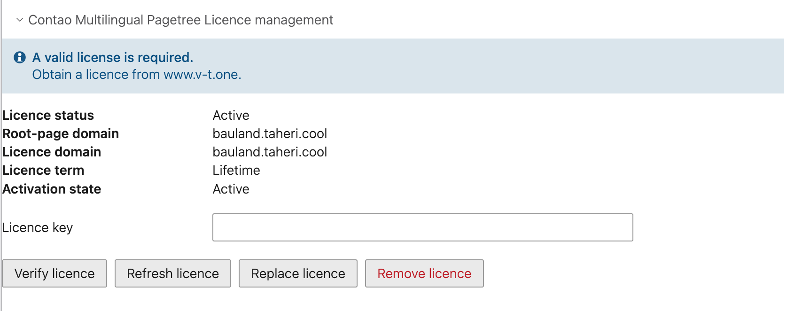
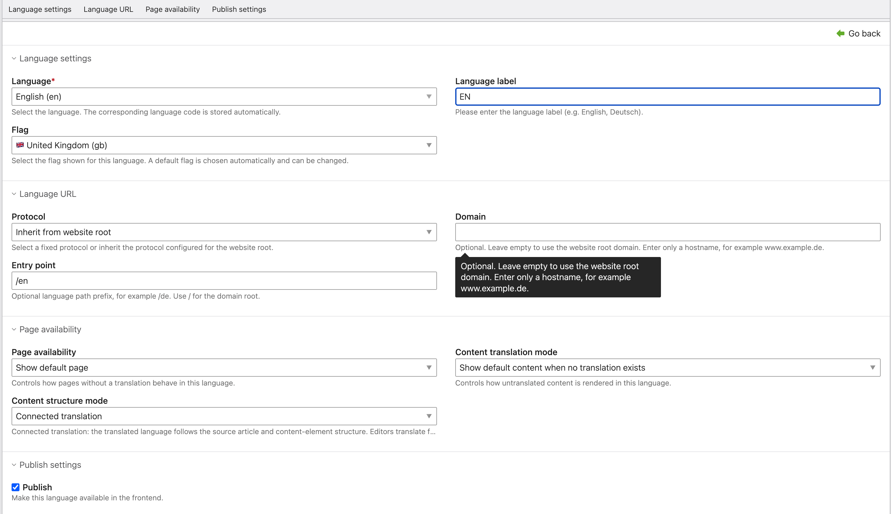
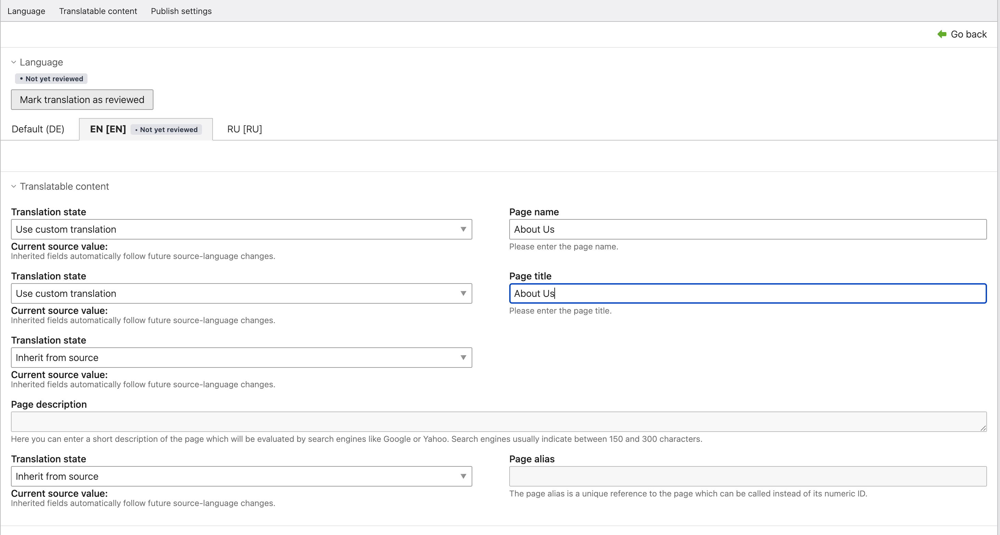

# Introduction

Contao Multilingual Pagetree adds an editorial translation workflow to Contao without creating a separate page tree for every language. All languages of a website root share **one** page structure, and translations are edited through language tabs inside the familiar Contao forms.

Where a language needs to be editorially independent, it can maintain its content separately instead. Both models are configured per language and can be changed at any time without losing data.

## About this manual

This manual describes the functionality the package actually implements. It is written for administrators who install and configure the package and for editors who translate with it.

German is the default language of this documentation. An equivalent German version is available at `docs/de/INSTALLATIONS-UND-BENUTZERHANDBUCH.md`.

| Item | Value |
| --- | --- |
| Product | Contao Multilingual Pagetree |
| Composer package | `vtinnovations/contao-multilingual-pagetree` |
| PHP namespace | `Vtinnovations\ContaoMultilingualPagetree` |
| Package type | `contao-bundle` |
| Licence | proprietary |
| Publisher | V&T Innovations |
| Website | https://www.v-t.one |

## Conventions

User-interface labels appear in **bold** and match the English labels in the Contao back end exactly. Console commands are shown for a Contao Managed Edition; adjust the console path if your installation differs.

> **Note:** All example domains in this manual (`example.com`, `ru.example.com`) are placeholders. Substitute your own hostnames.

# Feature overview

The following features are implemented in the package.

## Languages and structure

| Feature | Description |
| --- | --- |
| Multiple additional languages per root | Any number of target languages per website root |
| Shared page tree | All languages share one page structure |
| Language tabs | Language selection directly in page and content forms |
| Language selector from known languages | A selection list instead of free text entry |
| Automatic language-code storage | The language code is derived from the selection |
| Language label | A dedicated caption per language |
| Selectable flags | A flag can be chosen per language |
| Automatic default flag | A matching flag is preselected |
| Website-root isolation | Every root forms an independent website boundary |

## Language URLs

| Feature | Description |
| --- | --- |
| Inherited or fixed protocol | HTTPS, HTTP or inheritance from the root |
| Shared or dedicated domain | A language on the root domain or on its own domain |
| Configurable entry point | An optional language path per language |
| Dedicated language domain | The language is served from the root of its domain |
| Path-prefix support | Several languages under one domain |
| Canonical URLs | `rel="canonical"` per language |
| `hreflang` | Alternate references for every available language |
| `x-default` | Default target for unmatched languages |

## Translating

| Feature | Description |
| --- | --- |
| Page availability rules | Behaviour of untranslated pages per language |
| Content fallback rules | Behaviour of untranslated content per language |
| Connected translation | Structure follows the source language |
| Free language content | Independent article and content structure |
| Per-field inheritance or custom translation | For pages, articles, news, events and FAQs |
| Native content-element form | Content elements use the native Contao form |
| Translated RTE content | Rich-text fields are translatable |
| Editorial review status | Review state and review record for translations |
| Publication per language | Languages are released individually |

## Frontend

| Feature | Description |
| --- | --- |
| Language switcher as a frontend module | Module **Contao Multilingual Pagetree switcher** |
| Six layouts | Flags, labels and both, horizontal and vertical |
| Editable switcher template | Overridable through the Contao Templates area |
| Active-language handling | Mark or hide the active language |
| Unavailable-language handling | Hide or show as disabled |

## Operations

| Feature | Description |
| --- | --- |
| Licence management | Licence panel per website root |
| Permissions through standard Contao access controls | No package-specific permission required |
| German and English back-end translations | Complete labels in both languages |
| Integrity scan and repair | Console commands with a preview |
| Data report | Overview of the stored package data |

# System requirements

| Requirement | Version |
| --- | --- |
| PHP | `^8.1` |
| Contao | `^5.0` (`contao/core-bundle`) |
| Composer | For installation and updates |
| Database | The database used by your Contao installation |
| PHPUnit | `^10.5`, development only |

Contao 4 is not supported.

## Optional extensions

The news, calendar and FAQ integrations only become active once the corresponding Contao bundle is installed:

- `contao/news-bundle`
- `contao/calendar-bundle`
- `contao/faq-bundle`

The package is deliberately loaded after these bundles. If one of them is absent, the matching integration simply stays inactive; no error occurs.

## Write permissions

The PHP process needs write access below `var/`:

| Directory | Purpose |
| --- | --- |
| `var/contao-multilingual-pagetree/state/` | Internal operating state |
| `var/contao-multilingual-pagetree/licences/` | Stored licence status per website root |

The package only ever writes below `var/` and therefore outside the public directory. A directory that does not exist yet is a valid initial state.

# Installation

Contao Multilingual Pagetree is a proprietary package that is published on Packagist, so it installs into a standard Contao installation the usual way — through the Contao Manager or with Composer. No extra repository entry and no manually supplied archive are required.

> **Note:** The package page is [packagist.org/packages/vtinnovations/contao-multilingual-pagetree](https://packagist.org/packages/vtinnovations/contao-multilingual-pagetree). Proprietary refers to the licence terms, not to the distribution channel: the code is fetched like any other Composer package, and a V-T.ONE licence is still required to manage multilingual content.

## Before installation

1. Back up the database **and** the `files/` directory.
2. Verify the system requirements.
3. Record which languages each website root should serve.
4. Record which language is the source language of each root. The native Contao language of the root is authoritative.
5. Install and verify on a staging environment with a copy of production data first.

## First installation through the Contao Manager

1. Open the Contao Manager and sign in.
2. Go to the **Packages** section.
3. Search for `vtinnovations/contao-multilingual-pagetree` and add it.
4. Apply the package changes. The Contao Manager installs the package and updates the autoloader.
5. Go to the **Maintenance** section and run the database migration.
6. Clear the application cache.

The package ships a Contao Manager plugin. Bundle registration therefore happens automatically; no manual entry in a bundle configuration is required.

## First installation through Composer

```bash
composer require vtinnovations/contao-multilingual-pagetree
```

Then set up Contao and update the database:

```bash
vendor/bin/contao-console cache:clear
vendor/bin/contao-console contao:migrate
```

In a Contao Managed Edition the following command combines application setup including publication of the bundle assets:

```bash
vendor/bin/contao-console contao:setup
```

## Updating an existing installation

```bash
composer update vtinnovations/contao-multilingual-pagetree
vendor/bin/contao-console contao:migrate
vendor/bin/contao-console cache:clear
```

In the Contao Manager this corresponds to updating the package, followed by the database migration and a cache rebuild.

## Replacing an older ZIP installation

> **Warning:** Replace the package directory **completely**. If an archive is merely unpacked over an existing installation, files from an earlier version that have since been removed survive. This causes failures that are hard to trace.

1. Back up the database and files.
2. Remove the previous package directory completely.
3. Install the new package archive.
4. Update the autoloader (Composer or Contao Manager).
5. Run the database migration.
6. Rebuild the cache.

## Database update

The package creates its own tables and columns and ships migrations. The database update is therefore **mandatory**:

```bash
vendor/bin/contao-console contao:migrate
```

Run the command a second time afterwards. The second pass must complete without further changes.

The bundled migrations are designed to be repeatable and never delete ambiguous data. Ambiguities are reported by the integrity scan instead.

## Clearing and rebuilding the cache

```bash
vendor/bin/contao-console cache:clear
vendor/bin/contao-console cache:clear --env=prod
vendor/bin/contao-console cache:warmup --env=prod
```

In the Contao Manager this corresponds to the action that clears the application cache.

## Verifying the installation

**Verify bundle registration.** List the available console commands:

```bash
vendor/bin/contao-console list contao-multilingual-pagetree
```

If the package commands appear, the bundle is registered and the service container compiled successfully.

**Verify frontend assets.** The stylesheets, scripts and flag graphics of the package are published to the following path in the public directory:

```
bundles/vtinnovationscontaomultilingualpagetree/
```

If the directory is missing, repeat `contao:setup` or the asset installation of your installation.

**Verify templates.** The language-switcher template is provided by Contao as soon as the bundle is registered. It appears in the **Template** selection of the frontend module and in the Templates area.

**Verify the back end.** Open **Pages**. The globe action for language management must appear on a website root, and the **Contao Multilingual Pagetree Licence management** section must appear in the root's editing form.

# Licence activation and management

Managing multilingual content requires a valid licence.

The licence is free of charge and issued for life. There is no paid tier and no time-limited tier: one licence unlocks every feature of the product permanently. Free of charge does not mean licence-free, though — the licence still has to be activated on the website root before any multilingual management becomes available.

> **Note:** A valid V-T.ONE licence is required. Licences are available free of charge from [www.v-t.one](https://www.v-t.one).

## Opening licence management

1. Open **Pages**.
2. Edit the website root.
3. Open the **Contao Multilingual Pagetree Licence management** section.

The licence is managed **per website root**. An installation with several roots requires a separate activation for each root.



Figure 1 shows the section with an active licence. The notice box at the top states the licence requirement and where to obtain a licence, and is shown regardless of status.

## Status fields

| Field | Meaning |
| --- | --- |
| **Licence status** | Result of the last status evaluation, for example **Active**, **Not activated**, **Wrong domain** or **Expired** |
| **Root-page domain** | The domain configured on the root, against which the licence applies |
| **Licence domain** | The domain the licence was issued for |
| **Licence term** | Always **Lifetime**; this product is issued under no other term |
| **Activation state** | **Active** when a usable licence is stored for this root, otherwise **Not active** |

In Figure 1 the **Root-page domain** and the **Licence domain** match, the **Licence term** is **Lifetime**, and both **Licence status** and **Activation state** read **Active**. This is the normal state of a correctly activated perpetual licence: multilingual management is fully unlocked and no further steps are required.

## The Licence key field

The **Licence key** field accepts the key issued to you. Input is masked, and the key is not displayed again after saving. Leave the field empty for a status check or a refresh.

## The buttons

| Button | Effect |
| --- | --- |
| **Verify licence** | Checks the stored licence and reports whether it is intact and valid for this root. Nothing is changed. |
| **Refresh licence** | Retrieves the current licence status and updates the stored details. |
| **Replace licence** | Replaces the stored key with a newly entered one. |
| **Remove licence** | Removes the stored licence after a confirmation. Multilingual data remains untouched. |

If no licence is stored for the root yet, **Activate licence** appears instead of **Replace licence**.

## Activating a licence

1. Open the licence management of the root.
2. Make sure **Root-page domain** shows the correct domain. If it is empty, configure the domain of the root first and save.
3. Enter the licence key in the **Licence key** field.
4. Click **Activate licence**.
5. Check the status fields afterwards: **Activation state** must read **Active**.

## Domain consistency

A licence applies to **exactly one** domain. The comparison is exact: a `www` variant, a parent domain and a neighbouring subdomain are all different domains.

If the domain of the root differs from the licence domain, the licence panel reports **Wrong domain** and the licensed functions stay locked. Installations that move, and staging environments, therefore need a licence issued for the domain actually used there.

## Behaviour without a valid licence

A licence problem never takes a live website down.

| Area | Behaviour without a valid licence |
| --- | --- |
| Frontend delivery of existing translations | Continues unchanged |
| Language switcher, canonical URLs, `hreflang` | Continue unchanged |
| Creating and editing additional languages | Locked |
| Editing translations | Locked |
| Setting the review status | Locked |
| Free language content | Locked |
| Integrity repair | Locked; scanning stays available |

When a check fails, the restricted functions stay disabled instead of moving into an unverified state. The back end then shows the notice that a valid licence is required.

## Licence status on the console

```bash
vendor/bin/contao-console contao-multilingual-pagetree:registration
```

The command reports the registration status without displaying a key.

# Creating the website root

The package requires a regular Contao website root.

1. Open **Pages**.
2. Create a new page and select the page type **Website root**.
3. Set **Language** to the source language of the website. This native Contao setting is the source or default language; the package does not maintain a separate language for it.
4. Set **Domain name** to the hostname of the root. The domain is required for the licence assignment and for resolving language URLs.
5. Enable **Publish page** once the site should be reachable.
6. Save.

> **Important:** Without a configured domain, no licence can be activated for the root. The licence panel reports **Missing domain** in that case.

Every root forms an independent website boundary. The languages, translations and licence of one root are separate from those of any other root.

# Configuring additional languages

## Opening language management

1. Open **Pages**.
2. Click the **globe action** on the website root. It opens the language management of that root.
3. Choose **Add language** to create a target language, or **Edit language** to change an existing one.

The list shows the flag, the **Language label** and the language code for each language. **Toggle visibility** publishes or withdraws a language; **Delete language** removes it.



Figure 2 shows the complete form of a target language. It is divided into four sections matching the tabs at the top: **Language settings**, **Language URL**, **Page availability** and **Publish settings**.

## Language settings

### Language

The mandatory **Language** field contains a selection list of known languages, set to **English (en)** in Figure 2.

> **Note:** The corresponding language code is stored automatically. You do not need to enter it separately.

The source language of the root cannot be added as an additional target language, and the same target language can only exist once per root. The form rejects both cases on save.

### Language label

**Language label** is the caption editors see in the back end and visitors see in the language switcher. In Figure 2 it reads `EN`. Values such as `English`, `Deutsch` or `Русский` are common.

If the field is left empty, a label is derived from the selected language on save.

### Flag

**Flag** determines the flag graphic of the language. A default flag is preselected for every language — **United Kingdom (gb)** for English in Figure 2. You can change it at any time, for example to use the flag of the United States for English.

## Language URL

The **Language URL** section determines the address under which the language is served. All three fields are optional. This topic is covered in detail in the next chapter.

## Page availability

The **Page availability** section contains three selection fields: **Page availability**, **Content translation mode** and **Content structure mode**. They are described in the *Page availability*, *Content translation mode* and *Content structure mode* chapters.

> **Note:** These three settings are only meaningful for target languages. They have no effect on the source language of the root, which always uses the source page tree.

## Publish settings

The **Publish** checkbox makes the language available in the frontend. See the *Publishing languages* chapter.

## Saving

At the foot of the form are the familiar Contao buttons **Save**, **Save and close**, **Save and new**, **Save and duplicate** and **Save and go back**. All language-URL checks run server side on save.

# Language URL configuration

The **Language URL** section contains three fields.

## Protocol

**Protocol** determines the scheme the language is addressed with.

| Option | Effect |
| --- | --- |
| **Inherit from website root** | The protocol of the website root is used (default) |
| **HTTPS** | The language always uses HTTPS |
| **HTTP** | The language always uses HTTP |

In Figure 2 the field is set to **Inherit from website root**.

> **Note:** Two languages must not differ only by protocol while sharing the same hostname and entry point. Such a configuration is rejected on save.

## Domain

**Domain** is optional. If the field is left empty, the domain of the website root is used. Enter a hostname only, for example `www.example.de`.

Rejected are: entries with a protocol (`https://…`), with a path, with a port, with a query string and with a fragment. A hostname that already belongs to another website root is rejected as well, because incoming requests could then no longer be resolved unambiguously.

> **Important:** A dedicated language domain must point at the same Contao installation in DNS and in the webserver configuration, and a valid certificate must exist for it. The package cannot substitute for that.

## Entry point

**Entry point** is the optional language path, for example `/de`. The value `/` denotes the domain root.

Rejected are complete URLs, hostnames, query strings, fragments, the segments `.` and `..`, and repeated slashes.

## The three basic configurations

### 1. Root domain with a language path

| Field | Value |
| --- | --- |
| **Domain** | *(empty)* |
| **Entry point** | `/en` |

Result: `https://example.com/en`

This is the configuration shown in Figure 2 and the usual case when all languages live under one domain.

### 2. Dedicated language domain at its root

| Field | Value |
| --- | --- |
| **Domain** | `ru.example.com` |
| **Entry point** | *(empty)* or `/` |

Result: `https://ru.example.com`

The language is served from the root of its own domain. The language code is **not** appended.

### 3. Dedicated domain with a path

| Field | Value |
| --- | --- |
| **Domain** | `ru.example.com` |
| **Entry point** | `/ru` |

Result: `https://ru.example.com/ru`

## An empty entry point versus `/`

An empty **Entry point** and an explicit `/` are not the same in every case. What decides is whether the language has its own **Domain**:

| **Domain** | **Entry point** | Effective entry point |
| --- | --- | --- |
| set | *(empty)* | Domain root — same as `/` |
| set | `/` | Domain root |
| set | `/ru` | `/ru` |
| *(empty)* | `/en` | `/en` |
| *(empty)* | *(empty)* | The language code of the language, for example `/ru` |

The two states differ only in the last row: without its own domain and without an entry point, the record keeps the addressing it had before these fields existed — the language then lives under its language code. As soon as a dedicated domain is set, an empty entry point means the root of that domain.

## Unambiguous mappings

On save, the package verifies that the languages of a root remain unambiguously addressable. Rejected are, among others:

- two published languages with the same hostname and the same entry point,
- two languages claiming the same domain root,
- mappings that become identical only after normalisation, such as `de` and `/de`, or `WWW.EXAMPLE.DE.` and `www.example.de`,
- a distinction made by protocol alone,
- a hostname that already belongs to another website root.

An unpublished language claims no URL and therefore cannot collide.

> **Warning:** Moving a language to its own domain later, or changing its entry point, retires the previous address. Existing links are not rewritten. Configure a Contao redirect page or a webserver rule for the previous address.

A cache rebuild is required after every change to a language URL.

# Page availability

The **Page availability** selection field determines how pages are treated for which no translation exists in this language.

| Option | Behaviour |
| --- | --- |
| **Hide pages without translation** | Pages without an available translation are not accessible in this language. |
| **Show default page** | Pages without an available translation use the current default-language page content while retaining the requested language URL and interface language. |

In Figure 2 the field is set to **Show default page**.

## Effect in menus

With **Hide pages without translation**, untranslated pages do not appear in the navigation of this language. With **Show default page** they appear and lead to the default-language content.

## Effect on direct requests

With **Hide pages without translation**, a direct request for an untranslated page returns the Contao 404 error page. This is intended behaviour and not a defect.

With **Show default page**, the page is served. The requested language URL is retained, as is the interface language; only the page content comes from the default language.

> **Note:** Detail records — news, events and FAQs — always require their own published translation, even when the reader page is available through the fallback. This is by design: a detail page without its own translation would have no meaningful content.

# Content translation mode

The **Content translation mode** selection field determines how untranslated **content** is rendered in this language.

| Option | Behaviour |
| --- | --- |
| **Do not show content without translation** | A content field without a translation stays empty. |
| **Show default content when no translation exists** | A content field without a translation renders the source-language value. |

In Figure 2 the field is set to **Show default content when no translation exists**.

## Interaction with the content structure mode

With **Connected translation** the setting takes effect per field: a content element may have a translated headline and a body text that has not been translated yet. The mode then decides whether the body stays empty or renders the source text.

With **Free language content** the setting does not apply, because the language owns its content elements. Whatever has not been created there is not rendered.

> **Note:** **Page availability** and **Content translation mode** are separate settings. The first decides whether a page is reachable at all, the second how individual untranslated content fields are rendered.

# Content structure mode

The **Content structure mode** selection field determines whether the language follows the content structure of the source language or owns one of its own.

| Option | Meaning |
| --- | --- |
| **Connected translation** | The translated language follows the source article and content-element structure. Editors translate fields while type, position, order and relationships remain connected to the source. |
| **Free language content** | The translated language has an independent article and content-element structure and may differ completely from the source language. |

In Figure 2 the field is set to **Connected translation**.

## The practical difference

**Connected translation** is the normal case for websites that should say the same thing in every language. When the source language adds a new content element, it appears immediately in every connected language and waits for translation there. Editors cannot change the structure of a connected language — which is exactly what keeps the languages in step.

**Free language content** is for languages that are editorially independent: a country site with its own offers, its own ordering and its own content elements. Source-language content is not rendered there automatically.

## Switching the mode

> **Important:** Switching modes deletes **no** data. The records of the other mode remain stored and simply stop rendering. Switching back restores the output.

When switching, a confirmation states how many connected and how many free records remain stored and how many of them will stop rendering. The change is applied only after an explicit confirmation.

Like every other feature, **Free language content** requires the activated licence.

# Publishing languages

The **Publish** checkbox in the **Publish settings** section makes the language available in the frontend. In Figure 2 it is enabled.

Only published languages

- are reachable in the frontend,
- appear in the language switcher,
- are named in `hreflang` references,
- claim a language URL.

An unpublished language can be prepared in the back end without visitors seeing it. This is the normal way to finish a translation before it goes live.

Publication can also be changed directly in the language list through **Toggle visibility**. That route applies the same language-URL checks: if publishing the language would claim an address that is already taken, the action is rejected with a message.

# Translating pages

## Opening a page in another language

1. Open **Pages**.
2. Edit the page in question.
3. Select the tab of the required language at the top of the form.



Figure 3 shows the page form in the target language. The tabs read **Default (DE)** for the source language and **EN [EN]** and **RU [RU]** for the configured target languages. The active tab is highlighted and carries a status badge — in Figure 3 the badge **Not yet reviewed**.

**Default (DE)** returns you to the source language at any time. Switching between tabs changes no data.

> **Note:** Only languages configured and published for this website root appear. If an expected language is missing, check its configuration and its publication.

## Translatable page fields

The **Translatable content** section holds the translatable fields of the page:

| Field | Meaning |
| --- | --- |
| **Page name** | The name of the page as it appears in navigations |
| **Page title** | The title of the page, usually shown in the browser title and in search results |
| **Page description** | The short description for search engines |
| **Page alias** | The unique reference that can be called instead of the numeric page ID |

Technical and structural fields of the page — page type, redirect target, access protection and the like — are deliberately not translatable. They belong to the structure and stay the same in every language.

## Per-field translation state

Every translatable field has a **Translation state** selection field that determines the origin of the value:

| Option | Meaning |
| --- | --- |
| **Inherit from source** | The field follows the source language. |
| **Use custom translation** | The field has its own value, maintained in this language. |
| **Leave deliberately empty** | The field is intentionally empty in this language. |

Below each selection field the entry **Current source value:** shows the value the source language currently holds, together with the note: *Inherited fields automatically follow future source-language changes.*

In Figure 3, **Page name** and **Page title** are set to **Use custom translation** and carry the translated value `About Us`, while **Page description** and **Page alias** are set to **Inherit from source**.

### What inheritance means

When a field is set to **Inherit from source**, it follows the source language permanently. If the value changes there later, the target language adopts the change automatically — without anyone having to touch the translation again.

When a field is set to **Use custom translation**, it is decoupled from the source language. Later source-language changes do not alter the translated value; they do, however, become visible in the review status.

**Leave deliberately empty** distinguishes an intentionally empty field from one that has simply not been translated yet. This matters because an untranslated field would render the source value depending on the configured mode.

> **Note:** This per-field **Translation state** applies to pages and to article, news, event and FAQ translations. **Content elements do not use it.** See the next chapter.

## Publication of the translation

The **Publish settings** section holds the publication settings of the translation:

| Field | Meaning |
| --- | --- |
| **Publish page** | Show the page in this language on the website |
| **Show from** | The point in time from which the translation is shown |
| **Show until** | The point in time until which the translation is shown |

These settings apply per language. A page can be published in the source language and still withheld in a target language.

## Review status

Above the language tabs is the editorial review status of the translation together with the **Mark translation as reviewed** button.

| Status | Meaning |
| --- | --- |
| **Not yet reviewed** | The translation has never been marked as reviewed. |
| **Up to date** | The translation was reviewed and the source language has not changed since. |
| **Needs review** | The source language has changed since the last review. |
| **Source record unavailable** | The connected source record is missing, so the translation cannot be reviewed. |

The status also appears as a badge on the language tab — in Figure 3 the **EN [EN]** tab carries the badge **Not yet reviewed**.

When a source field changes, the status switches to **Needs review** and the changed source fields are named. After the review, **Mark translation as reviewed** resets the status and records the time and the user.

> **Note:** The review status is an editorial aid. It does not block publication: a translation with the status **Needs review** continues to be delivered.

## Saving and switching languages

Save with **Save**, **Save and close**, **Save and new**, **Save and duplicate** or **Save and go back**. What is saved is always exactly the language of the active tab.

> **Important:** The values of the source language are never changed when a translation is saved. However, if you switch tabs **without** saving first, your entries are lost — as in any Contao form.

# Translating content elements

## The native form

In a target language, content elements are edited in the **native Contao content-element form**. These are the same legends, the same field order, the same input fields, the same rich-text configuration and the same subpalettes as in the source language. Fields contributed by other extensions also appear unchanged.

Only the language of the **values** changes. The type and structure of the element belong to the source language.

## Translating a content element

1. Open the article and the content element inside it as usual.
2. Select the tab of the required language at the top.
3. Translate the fields.
4. Save.

Opening a language tab creates nothing by itself. Only saving writes values into the target language.

## Prefilling from the source language

Fields are prefilled with the source-language values as long as no translation exists. This shows editors the source text exactly where they will replace it.

A field that still equals the source value is not stored as a separate translation. It continues to follow the source language.

## No per-field translation state

> **Important:** Content elements use **no** per-field **Translation state** selectors and show **no** **Current source value** blocks. There is also **no** **Translatable content** legend for content elements. The active language tab already states the language being edited unambiguously.

Whether a value is a real translation, an untouched fallback or a deliberate blank is derived from the submission itself. Editors do not have to configure anything for this.

Content elements also have **no** review controls of their own. The editorial review status exists at the level of page, article, news, event and FAQ translations.

## Translatable fields

The content-bearing fields of the respective element type are translatable, in particular:

- the **Headline**,
- the **Text** including rich-text formatting,
- further textual fields of the element type, as far as they are provided for in the translation store.

Structural and technical fields — element type, sorting, CSS settings, references and the like — are deliberately not translatable. Only approved fields are stored at all; a crafted submission cannot turn one into a translated field.

> **Note:** Fields contributed by third-party extensions appear in the form but become translatable only after they have been registered through the provided extension point.

## Connected and free content structure

With **Connected translation**, the articles and content elements of the target language follow the structure of the source language. Only values are translated; type, position, order and relationships remain connected.

With **Free language content**, the target language owns its articles and content elements. They are created, sorted and deleted there as usual. Source-language content is not rendered automatically.

## Saving

The translation is written by all native save actions:

- **Save**
- **Save and close**
- **Save and new**
- **Save and go back**

Saving a translation does not overwrite the source language and does not create a version of the source element. If a save fails, that is reported instead of silently succeeding.

## Frontend output

What an untranslated content field renders is decided by the **Content translation mode** of the language: **Show default content when no translation exists** renders the source text, **Do not show content without translation** renders nothing.

Whether the page is reachable at all is decided beforehand by **Page availability**.

# Frontend language switcher

## Creating the module

1. Open **Layout → Themes** and the **Modules** of the theme you want.
2. Create a new module and select the type **Contao Multilingual Pagetree switcher**. The module is in the **Miscellaneous** category.
3. Configure the options.
4. Include the module in your page layout or through a content element of type *Module*.

## Back-end options

### Switcher style

The **Switcher style** selection field determines the display style. Six styles are available:

| Style | Output |
| --- | --- |
| **Horizontal Flags** | Flags only, side by side |
| **Horizontal Labels** | Language labels only, side by side |
| **Horizontal Flags with labels** | Flag and label, side by side |
| **Vertical Flags** | Flags only, stacked |
| **Vertical Labels** | Language labels only, stacked |
| **Vertical Flags with labels** | Flag and label, stacked |

**Flags** are the flag graphics configured per language; **labels** are the respective **Language label**.

### Unavailable languages

The **Unavailable languages** selection field decides how languages are presented in which the current page or detail record is not available:

| Option | Effect |
| --- | --- |
| **Hide unavailable languages** | The language does not appear (default) |
| **Show unavailable languages as disabled** | The language appears but is not clickable |

### Hide active language

The **Hide active language** checkbox removes the currently active language from the list. If it is not set, the active language appears and is marked as active.

### Module template

The **Module template** field in the **Template settings** section selects the output template. The default is `mod_language_switcher`.

## Linking

The language switcher always links to the **page-equivalent** target: a visitor on a subpage lands on its translation, not on the home page.

| Case | Link |
| --- | --- |
| Translation exists | Direct link to the translation |
| No translation, mode **Show default page** | Link to the fallback output under the target language's language URL |
| No translation, mode **Hide pages without translation** | No link; handled according to **Unavailable languages** |
| Target language on a dedicated domain | Absolute link to that domain |
| Target language with an entry point | The link contains the configured entry point |

Protocol, hostname and entry point always come from the configuration of the target language.

On news, event and FAQ detail pages the switcher additionally takes into account whether the detail record is available in the target language.

## Canonical URLs, `hreflang` and `x-default`

In addition to the switcher, the package emits metadata automatically:

- `<link rel="canonical">` with the canonical address of the current language,
- `<link rel="alternate" hreflang="…">` for every available language,
- `<link rel="alternate" hreflang="x-default">` as the default target.

All of these use the protocol, hostname and entry point of the respective target language. A frontend module is not required for this.

## Using a custom template

The output template can be overridden without modifying package files.

> **Warning:** Never edit files inside `vendor`. Such changes are lost with the next update.

1. Open the **Templates** area in the Contao back end.
2. Choose **New template**.
3. Select `mod_language_switcher` from the list of available templates.
4. Choose the target directory. For a theme-specific template, place it in the template directory of that theme; for an installation-wide template, in the general template directory.
5. Edit the copy that was created.
6. Select the copy in the module under **Module template**.

Theme-specific templates apply only to the pages of that theme. This allows several websites in one installation to use different language switchers.

> **Note:** After creating or changing a template, a cache rebuild is required for the change to become visible in the frontend.

# Domains and entry points

This chapter summarises how several languages can be distributed across domains and paths.

## All languages under one domain

The source language lives on the domain of the root, and every target language receives an **Entry point**.

| Language | **Domain** | **Entry point** | Result |
| --- | --- | --- | --- |
| German (source language) | — | — | `https://example.com` |
| English | *(empty)* | `/en` | `https://example.com/en` |
| Russian | *(empty)* | `/ru` | `https://example.com/ru` |

This is the simplest variant: one certificate, one DNS record, one webserver host.

## A dedicated domain per language

Every language receives its own domain and is served from its root.

| Language | **Domain** | **Entry point** | Result |
| --- | --- | --- | --- |
| German (source language) | — | — | `https://example.com` |
| English | `en.example.com` | *(empty)* | `https://en.example.com` |
| Russian | `ru.example.com` | *(empty)* | `https://ru.example.com` |

Every additional domain must point at the installation in DNS, be configured in the webserver, and have a valid certificate.

## Mixed operation

Both variants can be combined within one root.

| Language | **Domain** | **Entry point** | Result |
| --- | --- | --- | --- |
| German (source language) | — | — | `https://example.com` |
| English | *(empty)* | `/en` | `https://example.com/en` |
| Russian | `ru.example.com` | *(empty)* | `https://ru.example.com` |

## Several website roots

Every root manages its languages independently. A hostname, however, may belong to only **one** root. Attempting to assign an already claimed hostname to a second root is rejected on save.

## Choosing the protocol

When **Protocol** is set to **Inherit from website root**, the language follows the root. A fixed value is mainly useful when a language domain has to use a different scheme.

> **Warning:** A cache rebuild is required after every change to **Protocol**, **Domain** or **Entry point**. Mappings and path prefixes are cached.

# Permissions

Access follows the native Contao mechanisms exclusively. The package introduces **no** permission of its own.

## Administrators

Administrators always have access to language management, the translation forms and the licence management of every website root.

## Regular back-end users

A regular user requires:

| Requirement | Meaning |
| --- | --- |
| Access to the **Pages** module | Without this module right, no language or translation work is possible |
| A page mount for the root | The website root in question must be included in the page mounts of the user or their group |
| The usual table and field rights | For the records and fields to be edited |

The page mount is the decisive boundary: a user without a mount for a root has no access there — neither to language management nor to translations nor to licence management.

## Field rights

Where field rights are assigned, they apply to translations as well. A field a user may not edit in the source language may not be edited in a target language either.

## Server-side checks

> **Important:** Every write action is re-checked server side. A button hidden or disabled in the form is not a permission, only a display.

## Licence and user rights are separate

The licence requirement is independent of back-end user rights. A user with every right cannot edit translations without a valid licence; conversely, a valid licence grants no user a right that Contao has not given them. Both conditions must be met.

# Cache and database updates

## When a database update is required

| Occasion | Required |
| --- | --- |
| First installation | Yes |
| Updating the package | Yes |
| Replacing a ZIP installation | Yes |
| Changing a language configuration | No |
| Creating a translation | No |

```bash
vendor/bin/contao-console contao:migrate
```

Run the command again afterwards; the second pass must complete without changes.

## When a cache rebuild is required

| Occasion | Required |
| --- | --- |
| Installation or update | Yes |
| Change to **Protocol**, **Domain** or **Entry point** | Yes |
| Creating or changing a custom template | Yes |
| Publishing or withdrawing a language | Yes |
| Editing a translation value | No |

```bash
vendor/bin/contao-console cache:clear
vendor/bin/contao-console cache:clear --env=prod
vendor/bin/contao-console cache:warmup --env=prod
```

## Production

```bash
composer install --no-dev --optimize-autoloader
vendor/bin/contao-console contao:migrate
vendor/bin/contao-console cache:clear --env=prod
vendor/bin/contao-console cache:warmup --env=prod
```

# Upgrade procedure

## Before the upgrade

1. Back up the database and files.
2. Read the package's `CHANGELOG.md` and `UPGRADE.md`.
3. Run the integrity scan and resolve **Critical** and **Error** findings.
4. Reproduce the upgrade on a staging environment first.

```bash
vendor/bin/contao-console contao-multilingual-pagetree:integrity:scan --root=<rootPageId>
```

## Performing the upgrade

```bash
composer update vtinnovations/contao-multilingual-pagetree
vendor/bin/contao-console contao:migrate
vendor/bin/contao-console contao:migrate
vendor/bin/contao-console cache:clear
```

In the Contao Manager: update the package, run the database migration, clear the cache.

## After the upgrade

Verify:

1. The language URLs of every language — especially languages with a dedicated domain.
2. The switcher, the canonical link element, `hreflang` and `x-default` on a page **and** on a detail page.
3. The translation forms for pages and content elements.
4. The licence status of every website root.
5. The integrity scan.

```bash
vendor/bin/contao-console contao-multilingual-pagetree:integrity:scan --root=<rootPageId>
```

Clear only the caches you actually need. A full production cache rebuild is required when the route configuration or the language configuration of a root has changed.

# Troubleshooting

## A language does not appear in the frontend

| Check | Explanation |
| --- | --- |
| Is **Publish** enabled? | Only published languages are available in the frontend. |
| Does the language belong to the right root? | Languages are separate per root. |
| Was the cache rebuilt? | Language mappings are cached. |
| Is a valid licence stored? | Existing translations continue to be delivered, but new ones cannot be created without a licence. |

## Invalid or missing licence

Open the licence management of the root and read **Licence status**.

| Status | Cause and remedy |
| --- | --- |
| **Not activated** | No licence is stored for this root yet. Enter a key and choose **Activate licence**. |
| **Wrong domain** | The licence applies to a different domain. Check the domain of the root or use a matching licence. |
| **Missing domain** | The root has no domain. Configure the domain, save, then activate again. |
| **Expired** | The issuer withdrew this licence. Obtain a new one. |
| **Unsupported licence term** | The stored licence carries an end date. This product requires the lifetime licence; activate the correct one. |
| **Verification unavailable** | The status check was not possible. Try **Verify licence** again later. |
| **Refresh required** | Run **Refresh licence** once. |

## Wrong domain

Compare the value in the language's **Domain** field with the hostname actually requested. The comparison is exact: `example.com` and `www.example.com` are different hostnames, and a parent domain does not count.

## Wrong entry point

Check the **Entry point** field. Note the difference between an empty field and `/` when the language has **no** dedicated domain: without a dedicated domain, an empty field means the language code as the path.

## `/en` or another prefix returns 404

| Check | Explanation |
| --- | --- |
| Is the **Entry point** exactly right? | Check for typos and leading slashes. |
| Is the language published? | An unpublished language claims no URL. |
| Was the cache rebuilt? | Path prefixes are cached. |
| Is the page available in this language? | With **Hide pages without translation**, 404 is the expected behaviour. |

## A dedicated language domain returns 404

| Check | Explanation |
| --- | --- |
| Is the hostname exactly right? | `www` variants, parent domains and neighbouring subdomains are deliberately not matched. |
| Does the domain point at this installation? | Check the DNS record and the webserver configuration. |
| Is there a valid certificate? | Otherwise the connection fails before reaching Contao. |
| Is the language published? | An unpublished language claims no hostname. |
| Was the cache rebuilt? | Mandatory after a language-URL change. |
| Does the hostname belong to another root? | The mapping would then be ambiguous and is refused. |

## Cache not rebuilt

Symptoms are stale language URLs, an outdated template, or a switcher with wrong targets.

```bash
vendor/bin/contao-console cache:clear
vendor/bin/contao-console cache:clear --env=prod
```

## Database update not executed

Symptoms are error messages about missing tables or columns and incomplete forms.

```bash
vendor/bin/contao-console contao:migrate
```

If a migration fails, fix the reported cause and run the command again. Migrations are repeatable and delete no ambiguous data.

## An untranslated page is hidden

This is the expected behaviour with **Page availability** = **Hide pages without translation**. Choose **Show default page** if the default-language content should appear instead, or create the translation and publish it.

Also check **Show from** and **Show until** on the translation.

## Untranslated content is hidden

This is the expected behaviour with **Content translation mode** = **Do not show content without translation**. Choose **Show default content when no translation exists** if the source text should appear instead.

Also check the **Content structure mode**: with **Free language content** there is no fallback to the source language.

## The switcher does not link a language

| Check | Explanation |
| --- | --- |
| Is the language published? | Unpublished languages never appear. |
| How is **Unavailable languages** set? | With **Hide unavailable languages**, an unavailable language disappears entirely. |
| Is **Hide active language** enabled? | Then the current language is missing on purpose. |
| Is the page available in the target language? | With **Hide pages without translation** and no translation, no link is produced. |
| Is this a detail page? | Detail records require their own published translation. |

## The module template is not offered

| Check | Explanation |
| --- | --- |
| Is the bundle registered? | `vendor/bin/contao-console list contao-multilingual-pagetree` |
| Was the cache rebuilt? | Templates are cached. |
| Is the copy in the right directory? | A theme-specific template applies only to pages of that theme. |

## A stale custom template

If the package template has been extended, an older copy cannot render the new data. Compare your copy with the current original and adopt the changes. Rebuild the cache afterwards.

## A page or content translation is not saved

| Check | Explanation |
| --- | --- |
| Was the right language tab active? | What is saved is always the language of the active tab. |
| Was the form saved before switching tabs? | Switching tabs without saving discards the entries. |
| Did an error message appear? | A failed save is reported. |
| Is a valid licence stored? | Editing is locked without a licence. |
| Are the rights sufficient? | See the *Permissions* chapter. |
| Does the value differ from the source value? | An unchanged value is deliberately not stored as a separate translation. |

## A user has no access to the website root

Check in **Users** or **User groups**:

1. Is the **Pages** module allowed?
2. Do the page mounts include the website root in question?
3. Are the required table and field rights granted?

If the language management of a root does not appear, the page mount for exactly that root is usually missing.

## An unexpected data state

Run the read-only integrity scan:

```bash
vendor/bin/contao-console contao-multilingual-pagetree:integrity:scan --root=<rootPageId>
```

The scan changes nothing. Review the preview before confirming a repair; ambiguous relations are deliberately not resolved automatically.

# Removal and uninstallation

> **Warning:** Back up the database and files before removing anything.

## Removing a single language

1. Open the language management of the root.
2. Withdraw the language through **Toggle visibility** and check the frontend.
3. Then remove the language through **Delete language**.

## Removing only the language switcher

Remove the module from the layout, or the content element that includes it. The language configuration is unaffected.

## Removing the package

1. Back up the database and files.
2. Get an overview of the stored data:

   ```bash
   vendor/bin/contao-console contao-multilingual-pagetree:data-report
   ```

3. Remove the package through the Contao Manager or with Composer:

   ```bash
   composer remove vtinnovations/contao-multilingual-pagetree
   ```

4. Rebuild the cache.

> **Important:** Removing the Composer package deletes **no** stored translation data. The tables and columns remain in the database. This is intended: a later reinstallation finds the data unchanged.

If the data is to be removed permanently, that is a deliberate manual operation on the database — after a verified backup and guided by the data report.

# Feature reference

## Console commands

| Command | Purpose |
| --- | --- |
| `contao-multilingual-pagetree:integrity:scan` | Read-only integrity scan |
| `contao-multilingual-pagetree:integrity:repair` | Repair with preview and confirmation |
| `contao-multilingual-pagetree:data-report` | Report on the stored package data |
| `contao-multilingual-pagetree:registration` | Show the registration status |

Important options of the integrity scan:

| Option | Effect |
| --- | --- |
| `--root=<id>` | Restrict to one website root |
| `--language=<code>` | Restrict to one language |
| `--format=json` | Machine-readable output |
| `--execute` | Actually apply repairs |
| `--force` | Also apply destructive repairs |

Exit codes: `0` clean, `1` warnings or repairable findings, `2` errors or critical findings, `3` execution failure.

## Language configuration fields

| Field | Values |
| --- | --- |
| **Language** | Selection from known languages; mandatory |
| **Language label** | Free text |
| **Flag** | Selection; preselected automatically |
| **Protocol** | **Inherit from website root**, **HTTPS**, **HTTP** |
| **Domain** | Hostname or empty |
| **Entry point** | Path, `/` or empty |
| **Page availability** | **Hide pages without translation**, **Show default page** |
| **Content translation mode** | **Do not show content without translation**, **Show default content when no translation exists** |
| **Content structure mode** | **Connected translation**, **Free language content** |
| **Publish** | Yes/No |

## Language switcher module fields

| Field | Values |
| --- | --- |
| **Switcher style** | Six styles |
| **Unavailable languages** | **Hide unavailable languages**, **Show unavailable languages as disabled** |
| **Hide active language** | Yes/No |
| **Module template** | `mod_language_switcher` or a custom copy |

## Per-field translation state

| Value | Meaning |
| --- | --- |
| **Inherit from source** | Follows the source language permanently |
| **Use custom translation** | Own value in this language |
| **Leave deliberately empty** | Intentionally empty |

Applies to page, article, news, event and FAQ translations. Not to content elements.

## Review status

| Value | Meaning |
| --- | --- |
| **Not yet reviewed** | Never marked as reviewed |
| **Up to date** | Reviewed, source language unchanged since |
| **Needs review** | The source language changed since the review |
| **Source record unavailable** | The connected source record is missing |

## Licence status

| Value | Meaning |
| --- | --- |
| **Active** | A valid licence usable for this root |
| **Not activated** | No licence stored |
| **Wrong domain** | The licence applies to a different domain |
| **Missing domain** | The root has no configured domain |
| **Not yet valid** | The validity period has not begun |
| **Expired** | The validity period has ended |
| **Invalid licence** | The licence cannot be used |
| **Verification unavailable** | The status could not be determined |
| **Refresh required** | Run **Refresh licence** once |
| **Unsupported licence term** | The licence carries an end date; this product requires the lifetime licence |

## Runtime directories

| Directory | Content |
| --- | --- |
| `var/contao-multilingual-pagetree/state/` | Internal operating state |
| `var/contao-multilingual-pagetree/licences/` | Licence status per website root |

## Asset path

```
bundles/vtinnovationscontaomultilingualpagetree/
```

# Glossary

**Canonical URL** — The authoritative address of a document, emitted as `<link rel="canonical">`.

**Connected translation** — Content structure mode in which a language follows the structure of the source language.

**Detail record** — A record with its own detail page: a news item, an event or an FAQ entry.

**Domain root** — The path `/` of a domain, that is the address without any further path component.

**Entry point** — The optional path component under which a language is served, for example `/en`.

**Free language content** — Content structure mode in which a language owns its articles and content elements.

**`hreflang`** — HTML reference telling search engines the language equivalents of a page.

**Licence domain** — The domain a licence was issued for.

**Page availability** — The rule governing how pages without a translation are treated in a language.

**Page mount** — The Contao assignment of pages to a user or user group.

**Per-field translation state** — Whether an individual field follows the source language, carries its own value, or is deliberately left empty.

**Review status** — The editorial state of a translation relative to the source language.

**Source language** — The language translated from. It matches the native Contao language of the website root. Also called the *default language*.

**Target language** — A language configured in addition on a website root.

**Website root** — A Contao page of type *Website root*. It forms an independent website boundary.

**`x-default`** — `hreflang` reference for visitors whose language matches none of the configured languages.

# Support

## Licences

A valid V-T.ONE licence is required. Licences are available from [www.v-t.one](https://www.v-t.one).

## Contact

| Matter | Contact |
| --- | --- |
| Publisher | V&T Innovations |
| Website | [www.v-t.one](https://www.v-t.one) |
| Licences and sales | [www.v-t.one](https://www.v-t.one) |

## Information for a support request

Have the following ready:

1. The Contao version and the PHP version
2. The version of the package
3. The affected website root and its domain
4. The affected language with its **Domain** and **Entry point** values
5. The values of **Page availability**, **Content translation mode** and **Content structure mode**
6. The displayed **Licence status**
7. The exact error message and the steps to reproduce it
8. Where applicable, the output of `integrity:scan`

> **Warning:** Never send licence keys, credentials, session identifiers or back-end URLs containing request tokens. They are not needed to diagnose a problem.

## Further documentation

| Document | Location |
| --- | --- |
| User guide | `docs/USER-GUIDE.en.md` |
| Licence management | `docs/PRODUCT-REGISTRATION.en.md` |
| Runbook | `docs/RUNBOOK.en.md` |
| Changes | `CHANGELOG.md` |
| Upgrading | `UPGRADE.md` |

---

*Contao Multilingual Pagetree — Installation and User Manual. Publisher: V&T Innovations, [www.v-t.one](https://www.v-t.one). Contao is a trademark of its respective owners.*
